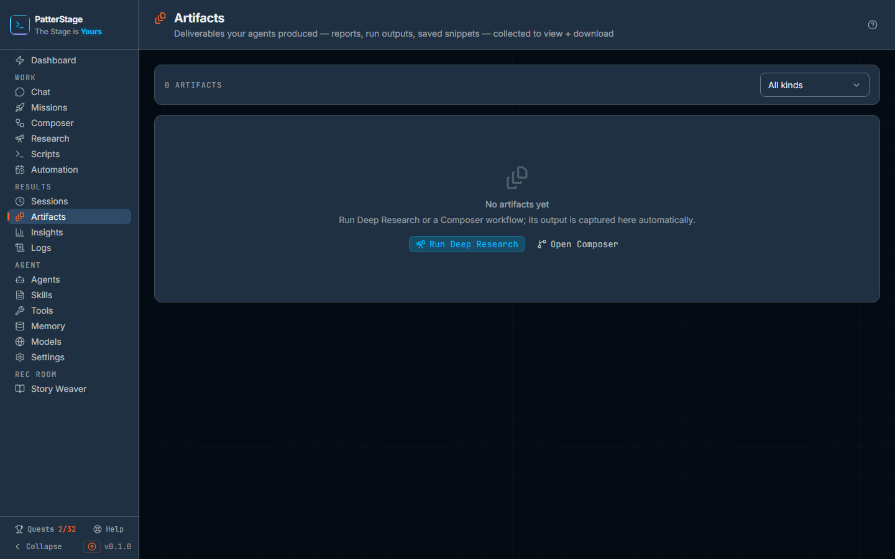

# Artifacts

Everything your agents actually produced, kept in one list you can read, download and clear out.

## What you see

The page opens at **Results → Artifacts** in the left rail. Under the title is a
thin bar with two things on it: a count of how many artifacts the list is
showing, and on the right a dropdown that starts at **All kinds**. The other
choices are **Deep Research**, **Composer**, **Missions** and **Saved**.

Below that is a grid of cards, newest first, three across on a wide window and
one across on a narrow one. Each card carries a small coloured icon for where it
came from, then the artifact's name, then a line of detail: the kind of work that
made it, the file extension it will download as, and how big it is. Under that is
how long ago it was produced.

Before anything has been produced you get an empty panel instead: a faint icon,
**No artifacts yet**, a line saying that Deep Research and Composer workflows
produce them, and two buttons that take you there, **Run Deep Research** and
**Open Composer**. Their output is captured here on its own.

Clicking a card opens a panel over the page, from the right on a wide window and
up from the bottom on a narrow one. Its heading is the artifact's name, and
beneath that a line giving the source, the content type and the size. The body is
the artifact itself. Reports and anything else written in Markdown are rendered
as a document, with headings, links and numbered citations; everything else is
shown as plain text in a scrolling block. Along the bottom of the panel are two
controls: **Download**, labelled with the extension it will use, and **Delete**,
which changes to **Confirm delete?** on the first click rather than acting
straight away.

If the list cannot be read at all, a banner takes its place with the reason and a
**Retry**. The empty panel is never shown over a read that failed, that is what
the banner is for. It does appear, though, when the dropdown is narrowed to a
kind nothing has been filed under yet, so put it back to **All kinds** before
concluding the list is empty.

## Typical use

**Read a report a research run produced.**

1. Open **Results → Artifacts**.
2. Set the dropdown to **Deep Research** if the list is long.
3. Click the card named after your question. The panel opens and renders the
   report, citations and all.

**Keep a copy outside PatterStage.**

1. Open the artifact.
2. Click **Download** at the bottom of the panel. It saves through your browser
   under a tidied-up version of the artifact's name, with the extension shown on
   the button.

**Clear out something you do not need.**

1. Open the artifact.
2. Click **Delete**. The button becomes **Confirm delete?**.
3. Click it again. The artifact goes, the panel closes and the list refreshes.
   If you leave it alone for a few seconds the button disarms itself.

## Notes

Capture is automatic. A Deep Research run saves its report when it finishes, a
[Composer](./composer.md) run saves the output of the last stage that produced
work rather than judged it, and a [mission](./missions.md) saves its output when
it completes. A workflow that ends on a review therefore files the piece and not
the review of it, and the artifact is named after the stage that wrote it,
followed by the objective the run was given. A run you cancelled
and a run that crashed leave nothing behind, on the grounds that half a report is
not a deliverable. One case does file something despite failing: a Deep Research
run whose search provider was down for every attempt is recorded as failed and
still files its report, because that report was written without any external
sources and the run's own error says so. Read the error before you trust it.

A single run files its deliverable once, however many times its finish is
processed. Running the same workflow again, or asking the same research question
again, is a new run, so it files a second artifact alongside the first rather
than replacing it.

You can also keep a single stage's output by hand. That control lives on the
Composer run canvas, not here: click a stage, and **Save as artifact** sits above
its output. It is filed under **Composer** alongside the run's own deliverable,
so the **Saved** filter stays empty until something files an artifact under it.

The dropdown narrows the list by where an artifact came from. There is no search
box and no date filter, and the list holds the 200 most recent. It refreshes
itself every few seconds while you have the page open, so an artifact captured by
a run that is still going appears without a reload.

Artifacts are text held inside PatterStage's own database, not files sitting in a
folder. That is why a database backup carries them and why nothing turns up on
disk when one is created. See [Backups](../running/backup.md) for what a backup
covers.

Deleting is permanent and there is no undo. An artifact can be the only surviving
copy of a report that took forty minutes to produce, so download it before you
delete it if there is any doubt. If a delete fails, a banner says so and the list
is left exactly as it was rather than quietly redrawing over the failure.

An artifact written as HTML is shown as its own source text rather than as a live
page. This is deliberate: the reader escapes every byte before rendering, so
nothing in an artifact can run in your browser.

Opening an artifact is one of the few reads PatterStage records. It is what
completes the **Read its artifact** step on [Quests](./quests.md), and it counts
towards the Workflows band on [Insights](./insights.md).

An artifact is not a [transcript](./sessions.md). The transcript is the whole
conversation a run had; the artifact is the part of it that was worth keeping.
For the idea behind that split, see [Artifact](../concepts/artifact.md).

Under the hood

Artifacts live in the `artifacts` table, added by migration `028_artifacts.sql`.
Its `content_type` column is one of `inline`, `file_path` or `url`; only `inline`
is used today, because the agent runtime returns text rather than files, and the
other two are there so real files can slot in later without a schema change.
`source_run_id` is a loose link to whichever run table matches `source_kind`, so
there is deliberately no foreign key on it.

| Route | What it does |
|---|---|
| `GET /api/artifacts` | Lists artifacts without their bodies. Optional `kind` filter; limit defaults to 200 and is capped at 500. |
| `POST /api/artifacts` | Saves one by hand. `sourceKind` defaults to `manual`; content is capped at 2,000,000 characters. |
| `GET /api/artifacts/[id]` | Returns one artifact with its content. |
| `DELETE /api/artifacts/[id]` | Removes the row. |

The read route records an `artifact.opened` event after the lookup succeeds, so a
missing id leaves no trace; the create route records `artifact.saved`. Both are
no-ops when the install is running read only, and neither can fail the request it
is attached to.

Automatic capture goes through `captureArtifactOnce`, which is a no-op when the
content is empty or when an artifact already exists for that combination of
source kind, run id and node id. Nested sub-workflow runs are skipped so that
only the parent run's deliverable is captured.

