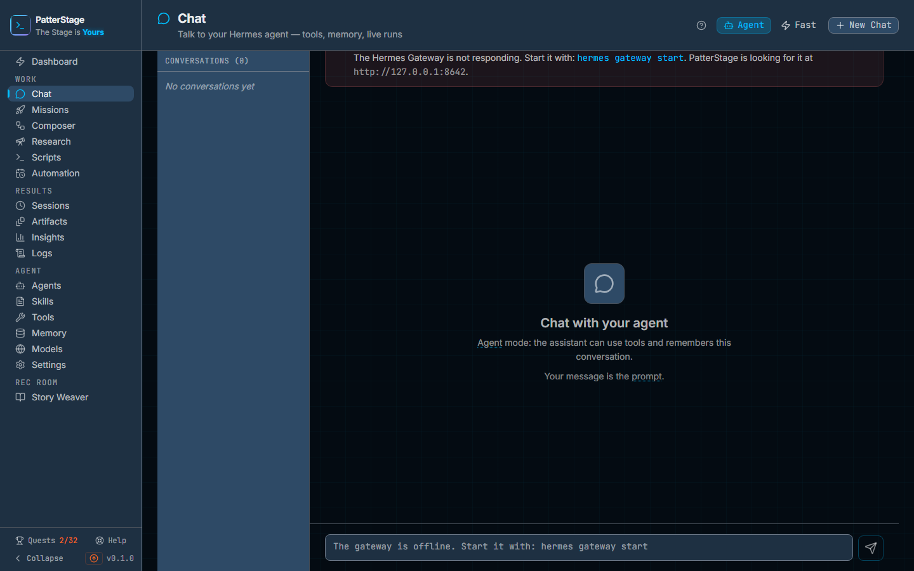

# Chat

Chat is where you talk to your [agent](../concepts/agent.md) a message at a
time, and watch it work while it answers.

## What you see

The header carries the page title, and on its right the three controls that
decide how your next message is answered: the **Agent** and **Fast** toggle, a
model dropdown that appears only when Fast is selected, and **New Chat**. The
toggle is greyed out while a reply is arriving, so a conversation cannot change
mode halfway through a turn.

Down the left is **Conversations**, with the number held in brackets, most
recently active first. On a phone, or in a window narrower than about a
thousand pixels, the list sits behind a **Conversations** button above the
conversation instead; choosing one closes it and the conversation takes the
whole width. Arriving at the page opens the top one. Each row shows the
conversation's title and how long ago it last changed. Move the pointer over a
row, or tab into it, and two more
controls appear at its right edge: a download button, and a delete button. The
download button saves the conversation as JSON; hovering it, or tabbing to it,
reveals a second option, **as CSV**, underneath. The delete button asks twice.
The first click turns it into a tick and the tooltip changes to say so, and a
second click within about three seconds removes the conversation. If you wait,
it disarms itself.

The middle column is the conversation. When something is wrong between
PatterStage and the agent's gateway, a banner sits above it. Two of those
banners appear wherever you are, because they mean your next message cannot go
anywhere: the gateway is not responding, or the gateway answered but rejected
PatterStage's key. Each one names what to do about it, and while the gateway is
not responding the message box is disabled and says how to start it. Two more
are advisory and only show on an empty conversation: one while the first
connection check is still running, and one saying no model is ready for chat.

Before the first message there is an empty state: the conversation's title, or
"Chat with your agent" when nothing is selected yet, then a line describing the
mode you are in, and a line telling you that your message is the
[prompt](../concepts/prompt.md). The word **prompt** there carries a hint you
can open, and in Agent mode so does the word **agent**.

Once there are messages, your turns sit on the right and the agent's on the
left, each behind a small avatar of its own and each stamped with the time it
was sent. An agent reply can carry two things above its text. A **Reasoning**
panel, collapsed, holding the thinking the model streamed before it answered.
And one card for each [tool](../concepts/tool.md) the turn used, showing the
tool's name and where it got to: running, done, failed, or awaiting approval.
Code blocks inside a reply show a **Copy** button when you hover them. While a
reply is on its way but has produced nothing yet, its bubble reads "Thinking…",
with three bouncing dots below it.

At the bottom is the message box, which grows as you type. Enter sends, Shift
and Enter together start a new line, and the placeholder says so. To its right
is a send button that turns into a red stop button while a reply is streaming.
If the agent asks to run a tool that needs your permission, a yellow strip
appears above the box naming the tool, with **Deny** and **Approve**.

## Typical use

### Ask the agent to do something

1. Leave the toggle on **Agent**, which is where it starts.
2. Type what you want and press Enter. Your message appears on the right and a
   placeholder appears on the left.
3. Watch the reply build: reasoning first if the model produced any, then a card
   for each tool as it is called, then the text streaming in.
4. If the approval strip appears, read the tool name and choose **Approve** or
   **Deny**. The turn carries on either way.
5. Ask a follow up. The agent still has the earlier turns, because the whole
   conversation is one [session](../concepts/session.md).

Each message you send in this mode is a real [run](../concepts/run.md), the same
kind of run a mission produces on [Missions](./missions.md).

### Get a quick answer with no tools

1. Click **Fast**. A model dropdown appears next to the toggle.
2. Leave it on **Agent Default**, or pick one of the models from your registry
   on [Models](./models.md).
3. Type and press Enter. The reply streams straight back from the model.

Fast mode still sends the earlier turns on screen along with your message, so it
follows the thread. What it does not do is use tools, or open a run. It is for
the question you want answered rather than acted on.

### Keep a copy of a conversation

1. Move the pointer over the conversation's row in the left column.
2. Click the download button. The transcript is saved as a JSON file named after
   the conversation.
3. For a spreadsheet instead, keep the pointer on the download button and click
   **as CSV**. That file has one row per turn: role, content, status and
   timestamp.

Both formats export the row you clicked, not whichever conversation happens to
be open.

## Notes

**The two modes differ in more than speed.** Agent mode submits a real run, so
the agent has its tools, its instructions and the conversation's session. Fast
mode asks the model one question and prints the answer. The model dropdown only
exists in Fast mode, because in Agent mode the model is the one the agent is
already configured with, and picking a different label in Chat would not change
it. If the "Model not ready for chat" banner appears, set an agent default on
[Models](./models.md) and push it to the agent.

**Naming.** Typing into a Chat with no conversations creates one named after the
first fifty characters of your message. Clicking **New Chat** creates one called
New Chat, and it keeps that name only until you send something. Your first
message renames it, using the message's first line trimmed to about fifty
characters. That rename is why clicking **New Chat** again while an unused one
is still there reuses it rather than making a second: a row still called New
Chat is a row nothing has been said in.

**Stop does different things in each mode.** In Agent mode it cancels the run,
and the reply on screen is replaced by "Stopped."; the text that had streamed in
is not kept, because it was only ever on your screen and the cancelled turn is
re-read from the server. In Fast mode there is no run to cancel, so stopping
ends the stream and the partial reply goes with it; the message reverts to its
placeholder, and the stored turn is left unfinished and tidied up later.

**An interrupted reply resolves itself, eventually.** Close the tab during an
agent turn and the reply keeps going on the server; reopening the conversation
folds the finished result onto the message. A Fast turn has nothing to fold, so
it is marked as interrupted by a sweep that runs when PatterStage next starts,
and only for turns older than thirty minutes.

**Deleting is local and permanent.** Removing a conversation removes its turns
with it, and there is no undo beyond the second click you have to make. The
agent's own session is not deleted.

**Nothing here deletes a message on a timer.** Conversations have a declared
window of 365 days of inactivity, the window applies to the whole conversation
rather than to single turns, and the prune ships switched off. Turning it on is
a command an operator runs by hand. Your ordinary safety net is a backup, which
is covered in [Backups](../running/backup.md).

**What a turn costs.** An agent turn spends whatever your provider charges for
the work the agent does, tool calls included, and because it is a run it counts
towards your [spend](../concepts/spend.md) figures. A fast turn is a single
completion and opens no run, so your provider still bills it but PatterStage
does not count it.

**The left column holds the hundred most recent conversations.** Older ones stay
in the database, but they stop appearing in the list, and because the download
buttons live on the list rows, a conversation you cannot see is one you cannot
export from here either.

**A failed read says so.** If the conversation list cannot be fetched you get
the reason and a **Retry** where the list would be, not an empty sidebar reading
"No conversations yet". A transcript that will not load behaves the same way in
the middle column, and the turns of the conversation you were reading before are
cleared rather than left sitting under the new title.

**A failed run says so too.** If the agent's reply fails, the bubble where the
reply would have been is an error: an icon, "The run failed", and the reason
the gateway gave, announced to a screen reader as it appears. **Retry** sends
the same prompt again as a new turn, and the failed attempt leaves the
transcript so it reads as one attempt rather than a question asked twice.

Under the hood

Conversations are server side, not browser storage. Migration `013_chat.sql`
adds two tables. `chat_conversations` holds one row per thread with the Hermes
`session_id` that gives it memory continuity, plus `profile_name`, `model` and
`previous_response_id`. `chat_messages` holds the turns; an assistant turn
carries `reasoning`, `tool_calls_json`, an optional `run_id`, and a `status`
that moves `pending` to `streaming` to one of `complete`, `failed` or
`cancelled`. Deleting a conversation cascades to its messages. The repository is
`src/lib/chat/chat-repository.ts` and the dispatch is
`src/lib/orchestration/chat-dispatch.ts`.

| Route | What it does |
|---|---|
| `GET /api/chat` | Lists conversations, newest first. Limit defaults to 100 and is capped at 500. |
| `POST /api/chat` | Creates a conversation and registers a Hermes session for it. A title collision retries once with a time suffix before giving up on the session. |
| `GET /api/chat/[id]` | Returns the conversation and its turns, reconciling any assistant turn whose run has already finished. |
| `DELETE /api/chat/[id]` | Removes the conversation and its turns. |
| `POST /api/chat/[id]/messages` | Sends one turn. In agent mode it submits a run and returns the run id; in fast mode it persists the turn and lets the browser stream the reply. |
| `PATCH /api/chat/[id]/messages/[messageId]` | Writes the final content, reasoning, tool calls, status and error onto an assistant turn. |
| `POST /api/chat/[id]/stop` | Cancels the conversation's active run. With no run it answers `{ stopped: false }`. |
| `POST /api/chat/[id]/approval` | Forwards an approve or deny decision for a tool. |

An agent reply is read from `GET /api/runs/[runId]/events`, the same run event
stream the rest of the console uses. Content deltas, reasoning, tool events and
approval requests are folded into one assistant message, and the first terminal
event wins. If the socket drops without one, the client waits and rereads the
conversation rather than guessing that the run failed. A fast reply is proxied
to the gateway's chat completions endpoint with `max_tokens` set to 4096.

Gateway health is checked on load and then every thirty seconds, and the poll
suspends while the browser tab is hidden. The offline banner names the gateway
address that was actually probed rather than a hardcoded port.

Every send records a `chat.message_sent` analytics event, which is what proves
the "Send a first message" quest and what puts Chat alongside missions on
Insights. Retention policy for `chat_messages` lives in the `retention_policy`
table, seeded disabled with 365 days by migration `032_retention.sql`, with a
floor of 30 days; `npm run db:retention` is the only thing that applies it.

