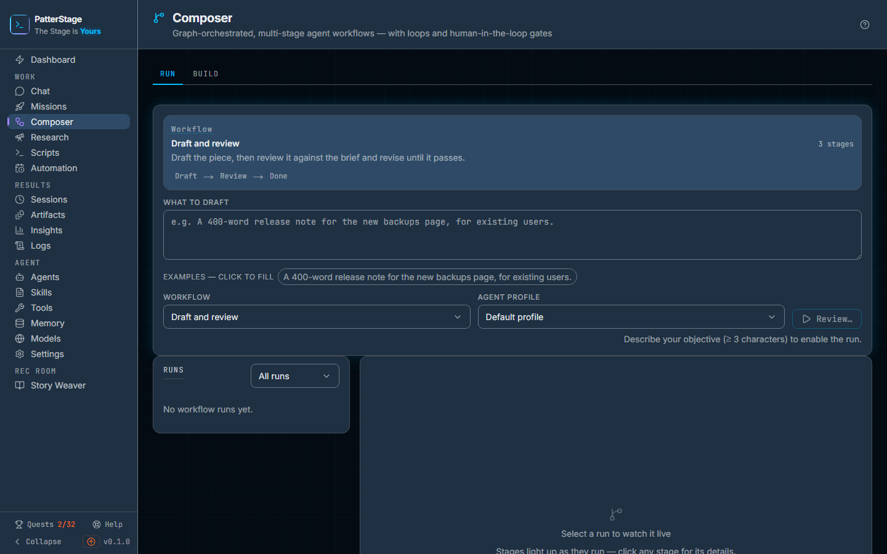

# Composer

Composer is for work that takes more than one go: the agent does one stage at a
time, each stage decides where the work goes next, and the stages you mark stop
and wait for your decision.

## What you see

Two tabs sit under the page title. **Run** is where you launch a
[workflow](../concepts/workflow.md) and watch it. **Build** is where you draw
one. Both keep what you were doing when you switch between them, so looking in
on a running job does not throw away an unsaved board.

### The Run tab

At the top is the launch card. A panel names the workflow you have selected, its
one-line description, and its stages in order as a row of chips, with the stages
that stop for you picked out in yellow.

Under that is the box you type your objective into. Its label and its greyed-out
example belong to the workflow rather than to the page: **Research question** for
one of the workflows that ships with the product, **What to draft** for another,
**Feature request / bug report** for the third. A workflow that carries example
objectives shows them as a row of buttons under the box, and clicking one fills
the box in.

Then two pickers, **Workflow** and **Agent profile**, and a **Review…** button.
Until the objective is at least three characters long the button stays disabled
and a line under it says so. The [profile](../concepts/profile.md) decides which
agent identity every stage runs under; leave it on **Default profile** if you
have not set any up.

**Review…** opens **Review before launch**, which lists the workflow, your
objective exactly as typed, and every stage it will run. Stages that can write to
your repository, meaning the ones that implement code, build tests or open a pull
request, are outlined in orange with a warning naming them, and the confirm
button says so as well. Nothing runs until you press it.

Below the launch card the page is two columns. On a phone, or in a window
narrower than about a thousand pixels, the runs sit behind a **Runs** button
above the pipeline instead; choosing one closes it.

On the left, **Runs**: every run of every workflow, newest first, with a status
filter above the list. Each row carries the first line of the objective, the name
of the workflow it was a run of, its status, and how long ago it started. A run
that is waiting says which kind of waiting it is doing: at a gate, or with a
question for you to answer.

On the right is the board. Before you pick a run it says "Select a run to watch
it live". Once a run is selected, a header line carries the objective, the status,
how long it has been going, and a **Cancel run** button that asks a second time
before it acts. If the run ended badly, the reason sits under the objective. When
a run is selected the launch card collapses to a **New run** bar, which reopens
it.

Under that header is the graph. Each stage is a box with a coloured dot for its
state, the kind of stage it is, an **HIL** badge if it stops for a human in the
loop, and a multiplier badge if it has had to run more than once. The stage in
flight glows and the routes leading out of it are animated. Clicking a stage that
has already run opens a panel from the right with its state, which attempt this
was, its verdict of pass or fail with the reasons and any suggestions it gave, the
gate decisions taken at it, any error, and its raw output with a **Save as
artifact** button.

While the run is waiting, a small panel appears in the top right corner of the
board. If a [gate](../concepts/gate.md) is open it names the stage, shows what
that stage produced, shows the verdict it reached if it reached one, and offers a
note box with **Accept** and **Reject**. If a stage stopped to ask you something
instead, the panel shows the question, an answer box and **Submit answer**.

### The Build tab

The board loads the first time you open this tab, so the Run tab does not
carry it; once open it stays loaded, and switching back to Run keeps whatever
is on it.

A toolbar runs across the top: **Edit workflow**, which chooses what you are
editing or starts a new one, then **Name**, **Description**, **Auto-layout**,
**Create** or **Save**, **Duplicate** and **Delete**. The result of a save appears
beside those buttons, green when it worked and pink when it did not.

Under the toolbar is the board. Top left is a **Drag to add** palette holding
Task, Research, Validate, Test and Group. Drag one onto the board to add a stage,
then drag from the dot at the bottom of one stage to the dot at the top of another
to connect them. Zoom controls and a small map of the whole board sit in the lower
corners.

Clicking a stage opens the **Stage** inspector on the right: its **Label**, its
**Kind**, and an optional **Instruction** that replaces the default wording for
that kind of stage. A Research stage also gets a query, and a Group stage gets a
picker for the workflow it runs inside itself. Three toggles set whether the stage
is a **HIL gate**, the **Start**, and the **End**. The start stage carries one
more group, **Workflow input (Run form)**, which is where the objective label, the
hint and the click-to-fill examples on the Run tab come from.

Clicking a connector opens the **Route** inspector instead: its **Condition**,
which is the word drawn on the line, and an optional label that is saved with the
route but not shown on the board. The conditions are listed under the
field: `always`, `on_pass`, `on_fail`, `on_approve`, `on_reject`, or `on_`
followed by an outcome word of your own.

## Typical use

### Run one of the workflows that came with the product

1. On the **Run** tab, choose **Research then summarise** in **Workflow**. The
   panel above shows its three stages.
2. Type your question into the box, or click one of the examples.
3. Press **Review…**, check what it lists, and press the confirm button.
4. The run appears at the top of **Runs** and is selected for you. The first stage
   lights up on the board, and the rest wait their turn.
5. Click any stage that has finished to read what it produced. **Save as artifact**
   keeps that output on the [Artifacts](artifacts.md) page.

### Answer a gate

1. When the run reaches **Check the findings** it stops. Its row in **Runs** says
   it is waiting at a gate, and the stage on the board carries the **HIL** badge.
2. A panel appears in the corner of the board carrying what the stage produced,
   so you can read the work where you are being asked about it. Type a note
   saying what you want changed, or why you are happy.
3. **Accept** sends the work on to the next stage. **Reject** sends it back along
   the route marked for a rejection, which in this workflow is back to Research,
   and your note travels with it into the stage being redone.

### Build your own workflow

1. On the **Build** tab, open **Edit workflow** and choose **+ New workflow**.
   Give it a **Name** and a **Description**.
2. Drag stages from the palette onto the board and connect them up.
3. Click each stage to name it and choose its kind. Turn on **HIL gate** for any
   stage that should wait for you. Exactly one stage must be the **Start**, and a
   run finishes when it reaches a stage marked **End**, so mark one of those too.
4. Click the start stage and fill in **Workflow input (Run form)** so that your
   workflow asks for the right thing when someone launches it.
5. Press **Create**. If something is missing, such as no start stage, a stage with
   no name, or a stage still called "New stage", the toolbar says which and
   nothing is saved.

## Notes

**Composer can be switched off.** It is on when the product is installed. If the
Composer link is missing from the sidebar under Work and the address answers "not
found", this install has it turned off, and turning it back on takes an edit to
the environment and a restart. See the
[environment reference](../running/env-reference.md).

**Most stages are a full agent run.** A stage costs tokens and takes as long as
the agent takes, so a sixteen-stage workflow is sixteen of those, one after the
other, and the cost lands in your [spend](../concepts/spend.md) figures attributed
to Composer. A Research stage runs the research engine instead, and its cost is
counted under Deep Research rather than Composer; a Group stage runs a whole
sub-workflow, so it costs whatever that workflow costs. This is the reason to
start with a three-stage workflow rather than the long one.

**Three workflows are there on the first start.** *Research then summarise*
researches a question, stops at a gate so you can check the findings, then writes
the summary. *Draft and review* drafts the piece and then reviews it against the
brief, looping back to the draft until the review passes. *Software Delivery* is
sixteen stages of engineering pipeline, which is a fine third workflow and an
intimidating first one.

**A gate is your decision, not the model's.** A stage can both reach a verdict
and be a gate. A verdict of fail there does not end the run: the panel shows the
fail and its reasons next to the work, and the run goes wherever you send it. A
stage that failed outright is not the same thing. It produced nothing to judge,
so it takes its failure route, or stops the run if the workflow has none.

**Loops are bounded.** A workflow can send failed work backwards, so a run could
in principle circle for ever. It cannot: one stage runs at most five times, and
a run stops after a hundred stage executions in total. Either way it ends with a
readable reason rather than by grinding on.

**Saving a workflow that has runs deletes those runs.** The runs are the history:
the stage outputs, the verdicts and the gate decisions all hang off them. Any save
to an existing workflow rebuilds it, so the page asks first, names the number of
runs, and offers to keep the history instead. Deleting a workflow asks the same
question. Neither is possible at all while one of its runs is still going: let it
finish or cancel it first.

**Unsaved edits are not thrown away silently.** Switching to another workflow with
an unsaved board asks whether to discard the changes or keep editing.

**Cancelling.** **Cancel run** takes two clicks. The run is marked cancelled
straight away and the agent is asked to stop the stage that was in flight. A run
that has already finished, failed or been rejected refuses the cancellation and
says why rather than pretending.

**If the live feed reports a failure.** A banner appears at the top saying what
went wrong. A connection that merely drops says nothing: the board falls back to
ordinary polling, so it stays correct and updates less promptly.

**The address bar remembers the run.** The workflow you are launching and the run
you are watching are written into the page address, so a reload or a shared link
comes back to the same run. The Build tab is not addressed: a reload returns you
to the Run tab, and the board to a new workflow.

**How this relates to its neighbours.** A [mission](missions.md) is one job,
optionally on a timer, with no branching and no stages. Composer is for the case
where the work has to be done in steps and checked along the way.
[Deep Research](research.md) runs the same research engine on its own page, with
no workflow around it, and it is not affected by the switch that turns Composer
off. Anything a stage produces can be kept as an
[artifact](../concepts/artifact.md).

Under the hood

Composer is gated by the `PS_COMPOSER` environment variable, documented in the
[environment reference](../running/env-reference.md). It defaults to on. Setting
it to `0` (or `false`, `no`, `off`) and restarting hides the sidebar link, makes
the page return 404, and makes every Composer API route answer 503, the live
event stream included.

Six tables hold the feature: `composer_workflows` (the definition),
`composer_nodes` (the stages, with each stage's canvas position kept in its
config under `_ui`), `composer_edges` (the routes and their conditions),
`composer_runs` (one execution), `composer_node_runs` (one stage execution, with
its attempt number), and `composer_approvals` (the gate decisions and their
notes). A stage's agent run is an ordinary row in `runs` carrying a
`composer_node_run_id`, which is how the reconciler knows to advance a graph
rather than finish a mission, and how spend is attributed to Composer.

The engine reads two markers out of a stage's output. `VERDICT: PASS` or
`VERDICT: FAIL`, with reason and suggestion lines, is what the stage detail panel
shows as a verdict and what `on_pass` and `on_fail` routes are decided by. A
stage can also print `OUTCOME: <label>`, and the engine will follow an
`on_<label>` route if one exists, which is how a stage fans out to more than two
destinations. `OUTCOME: needs_clarification` together with a `QUESTION:` line is
what makes the board stop and ask you something; your answer is added to the
objective and the asking stage runs again.

The loop guardrails are a per-stage attempt cap of 5, overridable per stage by
setting `maxAttempts` in its config, and a per-run backstop of 100 stage
executions.

The routes are `GET`/`POST /api/composer/workflows`,
`GET`/`PUT`/`DELETE /api/composer/workflows/[id]`, `GET`/`POST
/api/composer/runs`, `GET /api/composer/runs/[id]`,
`GET /api/composer/runs/[id]/events` for the live stream, and, on one run,
`POST /api/composer/runs/[id]/nodes/[nodeId]/approve`,
`POST /api/composer/runs/[id]/clarify` and
`POST /api/composer/runs/[id]/cancel`. A save or delete that would destroy run
history answers 409 with the count; repeating the request with
`?discardRunHistory=1` is the confirmation, and it is what the inline question on
the Build tab sends.

