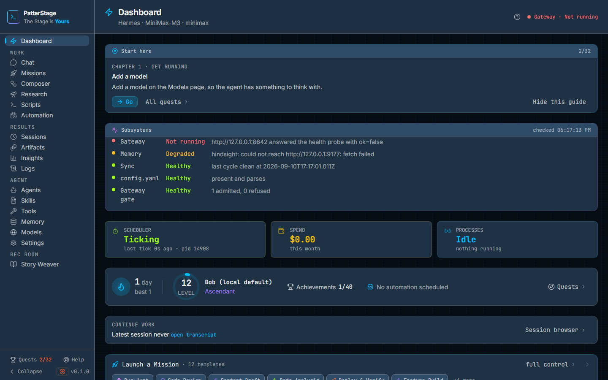

# Dashboard

This is the screen PatterStage opens on, and it is built to be read in a
glance rather than studied: whether the parts are up, what is happening now,
and one suggestion for what to do next.

## What you see

The board reads the machine while it is open and re-reads it every few seconds,
so what you are looking at is current rather than a snapshot from when you
opened the tab. It is arranged top to bottom, health first, then work.

**The header.** The word Dashboard, the same word the rail entry beside it
uses. Under it, the agent framework driving this install, Hermes on a standard
install, and the model that agent will use. If a model has been chosen in
Models but not yet written to the agent, the line says so. On the right, a badge
that says what the Subsystems panel's first row says about the agent's
gateway, in the same word and colour: Gateway · Healthy, Gateway · Degraded or
Gateway · Not running, with the reason in its tooltip. An install with no
agent and no reachable gateway reads NOT INSTALLED instead. Beside it, a **?**
that opens the guide for whichever screen you are on.

**Start here.** A card with one thing to do next, and only one. It names the
chapter it comes from, the quest, a sentence saying what to do, and a **Go**
button that takes you to the screen where you can do it. **All quests** opens
the full list, and **Hide this guide** puts the card away. The pair on the
right is how many quests you have finished out of the ones still on your list;
skipping a quest takes it out of both halves. The card does not appear until
the health checks have answered, and it disappears once there is nothing left
it can offer.

**Subsystems.** Five rows, each a coloured dot, a name, a state in words and
the reason behind it: Gateway, Memory, Sync, config.yaml and Gateway gate. The
states are Healthy, Degraded and Not running. The reason is the part worth
reading, because it names the address that refused a connection or the source
whose last sync failed rather than leaving you to guess. The panel header shows
the time of the check.

If the check itself cannot be made, the panel says so in place of the rows,
with a **Retry** button; while the first check is in flight it reads
"Checking…". Nothing on this board is green until it has actually been read.

**Three pills.** A row of three links, each a headline value with a smaller
line of detail beneath it. They are the three facts nothing else on the board
carries: the gateway and the memory store are on the Subsystems panel above
with their reasons, and the errors are in their own panel below.

- **Scheduler** is the background loop that fires schedules and reconciles
  dispatched runs: Ticking, Stalled, Follower, Never started or Unknown, with
  the age of the last beat. It opens System.
- **Spend** is this month's total across providers. It opens Insights.
- **Processes** is how many agent processes are running, or Idle, or Offline,
  with "running now" or "nothing running" beneath. It opens Agents.

**Progress.** One row of five things: a flame with your current run of active
days and your best, an agent level ring with the agent's name and title,
achievements unlocked out of the total, the next scheduled automation with its
name and how long until it runs, and a **Quests** link on the right.

**Continue work.** The most recent session, with how long ago it was touched
and a link to **open transcript**. **Session browser** on the right opens the
full list.

**Launch a Mission.** A strip of mission templates. Clicking one opens the
mission compose form with that template already selected. Up to six are
shown, your own templates first, then alphabetically; if you have more there is
a "+N more" control that expands the strip into every template grouped by
category. **full control** opens Missions.

**Active Missions.** Only present when something is in flight. Each row is the
mission name, its dispatch mode, a link to its session once one exists, its
status, its age, and a **Cancel** button.

**Platforms and Errors**, side by side. Platforms lists each messaging platform
Hermes can use as Configured or Not configured, with a footer showing when the
last background sync ran, whether it was clean, and a **Sync now** button. When
a source failed, its reason is printed underneath. Errors lists the ten most
recent errors, newest first, with **All**, **Error** and **Warning** filters
above it.

**Running Hermes Processes.** A card per process showing its type, plus its model,
turn count and last activity where those are known, and a refresh control
beside the heading. When nothing is running it says so.

## Typical use

**Check the machine before you start work.**

1. Open the board and read the Subsystems panel. Five Healthy rows means the
   gateway answered, memory answered, the last sync was clean, the agent's
   configuration parses and nothing is queuing at the gate.
2. If a row is Degraded or Not running, read its reason. It names the thing to
   fix: an address that refused the connection, a provider that did not answer,
   a source whose sync failed.
3. Glance at the Scheduler pill. If it reads Stalled or Never started, no
   schedule will fire and no dispatched mission will resolve, whatever the rest
   of the board says.

**Do the next thing the product suggests.**

1. Read the Start here card. It names one quest and what it asks of you.
2. Press **Go**. You land on the screen where the action happens.
3. Do the thing. The quest completes on its own from what the server recorded,
   and the card moves on to the next one the next time the board reads.

**Launch a mission and watch it.**

1. Pick a template from the Launch a Mission strip, or expand it and pick from
   a category. The compose form opens with that template selected.
2. Once the mission is dispatched, it appears in Active Missions with a status
   and a session link.
3. To stop it, press **Cancel** on its row. The button changes to **Confirm?**;
   press it again within a few seconds and the mission is cancelled. If you do
   not, it disarms itself and nothing happens.

## Notes

Nothing on this board is green until it has actually been read. The
Subsystems panel reading "Checking…" has not had an answer yet, and a panel
showing a failure with **Retry** means the check itself failed, which is a
different thing from a subsystem being down. The panel reports the check most
recently made, so it can flicker on a single failed probe; the Start here card
waits for a settled reading before it speaks. The header's badge carries the
same word as the panel's Gateway row, so the two never disagree; before the
first check has answered, the badge is empty.

While the board loads, the header is drawn and the body is a skeleton the
shape of the panels, rather than a spinner in an empty page.

The charts, the mission mix over time and the trophy case used to live here and
now live on [Insights](insights.md). This screen answers what is happening
now; Insights answers what has happened.

**Hide this guide** is not reversible from the console. Hiding the Start here
card does not affect your progress, and [Quests](quests.md) keeps the same
list with the reason any locked quest is unavailable on this machine, but there
is no control that brings the card back.

The Errors panel reads the ten most recent entries, and the count in its
header stops at ten and is not a total. Logs has the full list. The three
severity choices in the panel's header are one control: the arrow keys move
between them.
Repeated errors are collapsed on the way in: identical messages from the same
source render as one row with a count, so a gateway that logs the same
reconnection failure every few minutes does not fill the panel. An error
message is often longer than the row, so hover it to read the rest.

**Sync now** runs the background sync immediately and reports what happened.
It is the same sync the scheduler runs on its own, so pressing it is a way to
see the result now rather than a way to make something happen that otherwise
would not.

A platform showing Not configured means its token is absent from the agent's
environment file, which is edited on the Env section of Settings. Configured
means the token is present, not that the platform is currently connected: live
messaging also needs the gateway running.

If the read behind the three pills fails, the pills are replaced by a message
naming the failure with a **Retry** button rather than skeletons that never
resolve. The Progress row and the Subsystems panel behave the same way.

If the agent's configuration file cannot be parsed, an alert appears above the
Subsystems panel naming the parse error. Pushes and pulls stop until it is
repaired, and the [troubleshooting guide](../running/troubleshooting.md) covers
the repair.

The board makes no model calls of its own, so leaving it open costs nothing.
The Spend pill is this month's total for runs already made, and the budget that
governs it lives on Insights. Launching a mission from here does cost, at the
rate of whichever model that mission runs on.

Under the hood

The board is assembled from several reads on independent timers, so one slow
answer does not hold up the others. `/api/monitor` every 10 seconds feeds the
header, the Platforms panel and the Errors panel. `/api/agents` and
`/api/missions` every 15 seconds feed the Processes pill, the process cards and
the active missions. `/api/status/subsystems` every 15 seconds feeds the
Subsystems panel.
`/api/spend` every 30 seconds feeds the Spend pill. `/api/stats` carries the
streak, the achievements, the next automation and the evaluated quests. The
static bundle behind the header model line, the templates and the categories is
read once per visit.

The gateway probe times out after five seconds. A subsystem check that throws
renders as Degraded with the error text as its reason rather than removing the
row.

The header model line prefers the model and provider written to the Hermes
`config.yaml`, falls back to the default agent model in the Models registry
with a note that it has not been applied, and shows `-` when neither is set.

The Scheduler pill reads a heartbeat the scheduler writes to the database, with
the process id holding the lease. Follower means the lease is live and held by
a different process: schedules are firing, but not from this one.

A platform is configured by a token in the Hermes `.env`, shown on
the environment section of Settings (`/agent/settings#env`). The Scheduler
pill opens `/agent/settings/system`.

The preference that hides the Start here card is stored as `guide.hidden` in
the operator preferences table.

