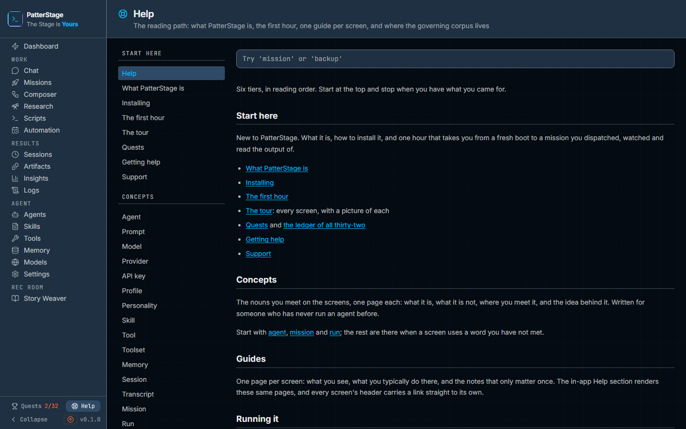

# Help

You do not have to leave the product to read its manual. Help is the same
documentation you are reading now, served by your own install, and every
screen can hand you the page written about it.

## What you see

**The header.** A life ring, the title of the page you are reading, and that
page's one-line summary beneath it. Arriving from the rail you land on
**Help**, the front page of the whole set; open any page from the contents and
the header takes that page's own name, with a **HELP** link on its left that
returns you to the front page. This is the only screen in the console with no
**?** in its header, because you are already in the guide.

**The contents**, down the left, and above the page on a narrow window. Six
group headings in small capitals, in reading order: Start here, Concepts,
Guides, Running it, Reference, Contributing. Under each, its pages. The one you
are reading is picked out in cyan. The guides are listed in the same order as
the rail on the left of every other screen rather than alphabetically, so the
two lists agree with each other.

**The search box**, at the top of the page column, with the example
"Try 'mission' or 'backup'" in it. Typing puts a count underneath, in the form
"7 matches" or "1 match", or the sentence "Nothing matches" followed by what you
typed. Results appear as a list: the heading that matched on the first line, the
page it belongs to on the second.

**The page.** The documentation itself: headings, prose, tables, commands and,
where a page has them, screenshots. It is part of the console's own page rather
than a box embedded in it, so it scrolls, selects and prints with everything
else.

**Previous and next**, at the foot. Two links naming the pages either side of
this one along the whole reading path, so following **next** from the last guide
takes you to the first page of Running it. At either end of the path only one of
the two appears.

**Before the documentation has been built**, the page column carries a single
panel headed "Help has not been built yet.", explaining that the guides are
generated from the repository at build time and are not kept in version control,
followed by the one command that builds them. There is no contents list and no
search until that has been run.

**An address that names no page** gives you "There is no such guide.", a
sentence saying that a renamed guide keeps its content under a new address, and
a **Back to the contents** button. You keep the rail and the frame.

**A page listed but not generated** shows an amber strip in place of the body,
naming the page and the command that rebuilds the set. It means a build was
interrupted rather than that the page has nothing to say.

## Help on the other screens

**The ?** sits at the top right of every other screen's header, beside that
screen's own buttons. It opens the guide for the screen you are on, and its
tooltip names it: "Help for Missions", "Help for Models". No screen can opt out
of it, and it is never dead: a screen with no guide of its own lands you on
**Help**, the front page of the set, instead; on a console whose
documentation has not been built it lands you on the panel that tells you how to
build it.

**The ? key** does the same thing from the keyboard. Press it anywhere that is
not a text box and you go to the same page the header's **?** points at. Typing
a question mark into a message, a filter or a name is left alone, and so are
combinations that hold ctrl, cmd or alt.

**Dotted underlines.** Seventeen words carry this product, and on nine screens
they are underlined with a dotted cyan line. A screen underlines its own wording
of the word, so where that differs from the concept the panel names, the concept
is in brackets here: agent and prompt on Chat; mission, run and Scheduled
(schedule) on Missions; profile and voice (personality) on Agents; skill on
Skills; tool and toolset on Tools; Memory provider (memory) on Memory, which
reads Set up memory while the store is unreachable; model, provider and
Credentials (API key) on Models; workflow and gate on Composer; report
(artifact) on Research. Press one and a small panel opens just beneath it with
the concept's own name, a one-sentence definition, and a link that ends with
that name, **Read more about Mission**, **Read more about API key**, into its
Concepts page. It covers nothing, traps nothing and stops no scrolling. Escape,
or a press anywhere else, puts the screen back as it was.

## Typical use

**Find out what a control on a screen does.**

1. On the screen itself, press **?**, or click the **?** at the top right of its
   header.
2. You land on that screen's guide, with its name in the header.
3. Read **What you see** for the control you are looking at. If you arrived on
   the contents instead, that screen has no guide of its own yet.

**Look something up by word.**

1. Open **Help** from the Home group in the rail.
2. Type into the search box. Results appear as you type, across every page:
   guides, concepts, the running-it pages and the reference.
3. Click one. You land on that page at the heading that matched, not at the top
   of it.

**Find out what a word on a screen means, without leaving the screen.**

1. Press the word where it is underlined with dots.
2. Read the sentence in the panel that opens.
3. Press **Read more about**, which ends with the concept's own name, to open
   the full Concepts page for it, or Escape to close the panel and carry on with
   what you were doing.

## Notes

Everything here is served from your own machine. Help makes no network request,
no model call and no charge, and works with the machine offline. Nothing you
search for leaves the console.

The pages are generated when the console is built, from the same documentation
that is published as a website and readable as plain text in the repository.
That is why a fresh copy that has not been built yet has no Help at all, and
says so with the command to fix it rather than showing you an empty page.

Links inside a page's body are written for that published website and point at
its file names. Following one inside the console lands you on "There is no such
guide" rather than on the page it names. The contents list on the left, the
search box, and **previous** and **next** are the ways to move between pages
here; the same links work on the website and in the repository.

Search is a plain match on the letters you type, against page titles, headings
and the text beneath each heading. It is not fuzzy and it does not rank: a whole
phrase only matches if the page contains that phrase exactly, so one word finds
more than three. At most twenty results are shown, so a very common word is
worth narrowing.

Not every word gets a hint. The seventeen underlined ones were chosen because
they are the words you cannot get on with the product without; every other
concept is a page in the Concepts group, reachable from the contents. A word
whose page has not been built renders as ordinary text with no control on it, so
you never press something that opens an empty box.

A guide that gets renamed keeps its content at a new address, which is why an
old bookmark lands on "There is no such guide" rather than on nothing. Start
from the contents and the page will be there under its new name.

If the answer is not here, [getting help](../start-here/getting-help.md) sets
out where to look next and how to report something, and
[troubleshooting](../running/troubleshooting.md) is organised by symptom. If you
have just installed the product, [the first hour](../start-here/first-hour.md)
walks the whole path once, and [Quests](quests.md) turns the same ground into a
list you can work through.

Under the hood

The corpus is generated by `npm run docs:build` from the markdown under `docs/`
into `public/help/`: `manifest.json` (every page, its tier, its reading number
and the screen it documents), `search.json` (one row per page plus one per
heading, each row's text capped at 400 characters, which is why a match very
deep inside a long section can be missed), `concepts.json` (the popover
definitions, taken from each Concepts page's own summary) and one HTML fragment
per page under `fragments/`. Images are copied alongside them. That directory is
not kept in version control, and the build runs as part of `prebuild`, so a
checkout that has never been built has no Help until it is. `PS_HELP_DIR` points
the reader at a corpus somewhere else.

Which guide answers for which screen is decided by the `screen:` key in a page's
front matter, matched against the current address by longest route prefix, so a
detail page inside a section gets the section's guide. Where a guide and a tour
page both claim a screen, the guide wins. The contents order for the guides
comes from the same module that builds the rail, so there is one ordering rather
than two.

A page address may contain only lowercase letters, digits, hyphens and slashes.
Anything else is refused before a file path is built, so no address typed into
the bar can read a file outside the corpus.

Opening a guide writes a `help.opened` event to the local database, alongside
everything else in
[the events the product records](../reference/analytics-events.md). An address
that matched no page writes nothing. The console in read-only mode records
nothing at all.

The built corpus is read once per server process. After rebuilding the
documentation under a running console, restart it to be certain you are reading
the new pages.

