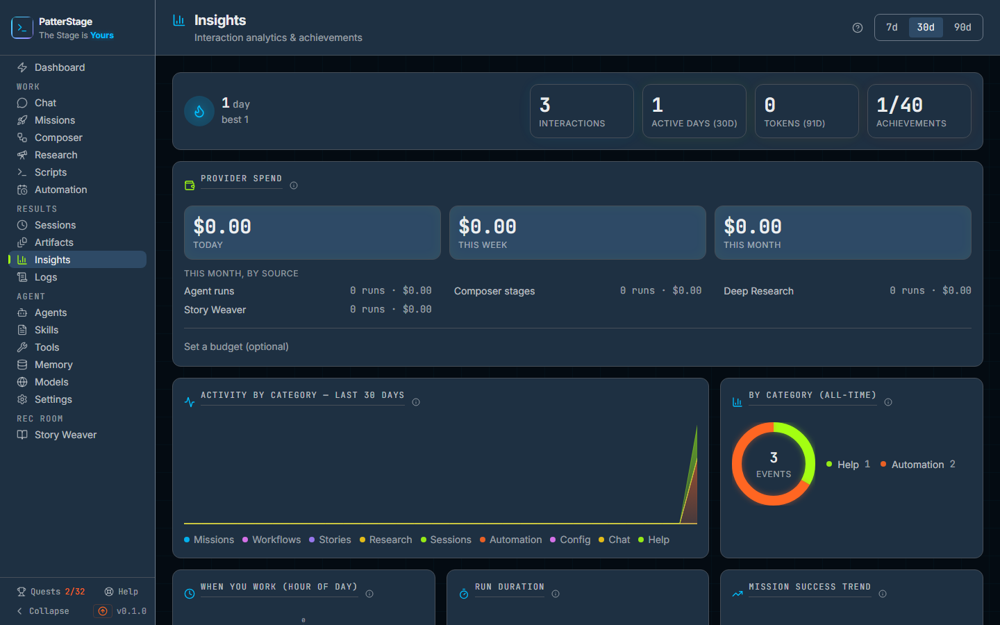

# Insights

The history page: what you have done with PatterStage, what it cost, and what you have earned for it.

## What you see

The header carries the page title and, on the right, a range switch reading **7d**, **30d** and **90d**. It opens on 30d. That switch drives most of the charts below it, and the cards that ignore it say so in their titles: **By category (all-time)**, **Mission mix (all-time)** and **Run activity, last 91 days**.

If nothing has been recorded yet, a single panel sits at the top: **No activity yet**, with a **Go to Missions** button. Everything else fills in as you use the product.

Below that, top to bottom:

- **A streak flame and four tiles.** The flame shows your current run of active days and your best ever. The tiles are **Interactions** (every recorded event, all time), **Active days** for the selected range, **Tokens (91d)**, and **Achievements** as unlocked out of total. Each tile names the period it covers, because the three token figures on this page cover three different things and none of them can be read without knowing which.
- **Provider spend.** Three totals, **Today**, **This week** and **This month**, then a line for each thing that spends money: Agent runs, Composer stages, Deep Research and Story Weaver, each with its run count and estimated cost. A figure priced at a fallback rate rather than one PatterStage holds is marked **estimated**, with a sentence under the list naming the models it has no price for. Underneath, a quiet link reading **Set a budget (optional)**, or your figure if you have set one. This is the only money on the page.
- **Activity by category** over the selected range, a stacked area chart with a colour legend, beside **By category (all-time)**, a ring with the running total in the middle and every category listed with its count.
- **When you work (hour of day)**, a 24 hour clock where a longer spoke means more activity in that hour; **Run duration**, a histogram bucketed from under five seconds to over five minutes, with each bucket's count above its bar and its range beneath; and **Mission success trend**, completed against failed per day.
- **Tokens by model** for the selected range, **Top missions** by number of runs, and **Mission mix (all-time)**, a ring splitting every mission you have ever written into Successful, Failed, Dispatched, Queued and Draft.
- **Run activity**, a heatmap of the last 91 days with a count of active days and total runs beside the title.
- **Achievements**, a compact trophy case at the foot of the page. It shows your points, a tally per rarity, your rarest earned badges and the ones you are closest to unlocking. The button below it reads **Show all** with the number of achievements after it, and expands the panel into the full grid, with **All**, **Unlocked** and **Locked** filters. Once the grid is open the button reads **Show less**.

Most card titles carry a small information icon. Hovering it explains what that chart counts.

Nothing on this page can be edited except the budget. Everything else is a reading.

## Typical use

**See what the last week actually looked like**

1. Click **7d** in the header.
2. The stacked area, the hour clock, the duration histogram, the success trend, tokens by model and top missions all redraw against those seven days, along with the **Active days** tile.
3. Read the success trend first. Green is completed missions, pink is failed. A pink week is the signal to open the run in [Missions](./missions.md) and look at what came back.

**Find out what you are spending**

1. Read the three figures at the top of the provider spend panel. They are calendar periods: today, the current week, the current month.
2. Read the lines below them to see which part of the product spent it. A run whose token usage was never recorded is counted in the run count and reported in a sentence under the list rather than being priced at zero.
3. To put a ceiling on it, click **Set a budget (optional)**, choose day, week or month, type a figure in US dollars and click **Save budget**. A meter appears, showing what you have spent as a percentage of that figure. Pass the figure and a message says so, and says plainly that nothing has been stopped.
4. If you want the figure to do more than warn, tick **Hard stop**. Scheduled runs, the queue and Composer then pause once the figure is passed. Dispatching a mission by hand always works.

**Check your progress**

1. Scroll to the achievements panel and read the rarest badges you have earned and the ones closest to unlocking.
2. Click **Show all** for the whole catalogue, then **Locked** to see only what is left.
3. Hovering a badge names it, describes what unlocks it, and shows how far along you are.

## Notes

- **The range switch does not drive everything, on purpose.** The two rings and the **Interactions** tile are all time, because a share of your whole history is a different question from a share of last week. The heatmap is always the last 91 days. The **Tokens (91d)** tile counts tokens recorded against runs in the last 91 days, whatever started them, which is why it is larger than the tokens by model list beside it. Provider spend keeps its own calendar periods, because a budget is a month, not a rolling window.
- **Spend is an estimate, not an invoice.** It is worked out from the token counts already recorded against each run, priced from a short rate table. Where a model is not in that table, or a run recorded no model at all, the run is priced at a fallback rate and the panel says so rather than implying a published price. Check your provider's own billing for the real figure. See [spend](../concepts/spend.md) for what is counted and what is not.
- **Tokens by model and Top missions read the model from the mission**, so a Composer stage run, which has no mission of its own, does not appear in either. The spend panel does count those runs, which is why they are listed there as Composer stages.
- **A day counts as active** if a run completed on it or anything at all was recorded on it, so a day of chat or a Story Weaver chapter keeps a streak alive. The current streak stays alive as long as your most recent active day was today or yesterday, so checking first thing in the morning does not read as a broken streak.
- **Achievements are worked out fresh every time the page loads.** Nothing is stored, so they cannot drift out of step with what you did. The toast that congratulates you on an unlock belongs to the app shell and can appear on any screen; this page never fires one.
- **The same record of what you have done drives [Quests](./quests.md)**, which turn it into a guided path rather than a chart.
- **Your agents' levels are not here.** A level belongs to an agent rather than to you, so it is shown per agent on [Agents](./agents.md).
- **When a read fails**, a red banner appears at the top naming what failed, with a reminder that analytics start empty and fill in as you use PatterStage. Its **Retry** button refetches the streak and stats, the summary, the timeseries and the insights bundle together, so a single broken chart does not stay broken while the others recover. The provider spend panel is not on that button and reloads on its own poll. The figures otherwise refresh themselves every 30 seconds, and the streak, tokens, mission mix, heatmap and achievements every 20.
- **This is all local.** The history lives in the same database as everything else on your machine, and nothing here is sent anywhere. It is included in a [backup](../running/backup.md).

Under the hood

Every recorded interaction is one row in the `analytics_events` table, appended by the server after the action it describes has succeeded. There is no way for a browser to write one, so achievement progress cannot be forged.

The page reads five endpoints:

| Endpoint | What it returns |
|---|---|
| `/api/analytics` | Per type counts, all time and last 30 days, plus distinct active days |
| `/api/analytics/timeseries?type=&days=` | Gap filled daily counts; `days` must be 1 to 365, and anything else is refused |
| `/api/analytics/insights?days=N` | The composed bundle behind most cards: hour of day, category series, duration buckets, model usage, top missions, success trend. Here `days` is clamped to 1 to 365 rather than refused |
| `/api/stats` | Streaks, mission mix, run activity and the achievement catalogue |
| `/api/spend` | Spend per period and per source, the budget, and the verdict against it |

The budget is the one write: `PUT /api/spend`. Clearing the figure disarms the hard stop with it, a rule the database enforces as well as the form.

Event rows are kept for 400 days. Nothing deletes them on its own: the prune ships disabled and is a command you run by hand, `npm run db:retention`. It records a progress snapshot before it removes anything, because the lifetime totals on this page cannot be recomputed from a window.

