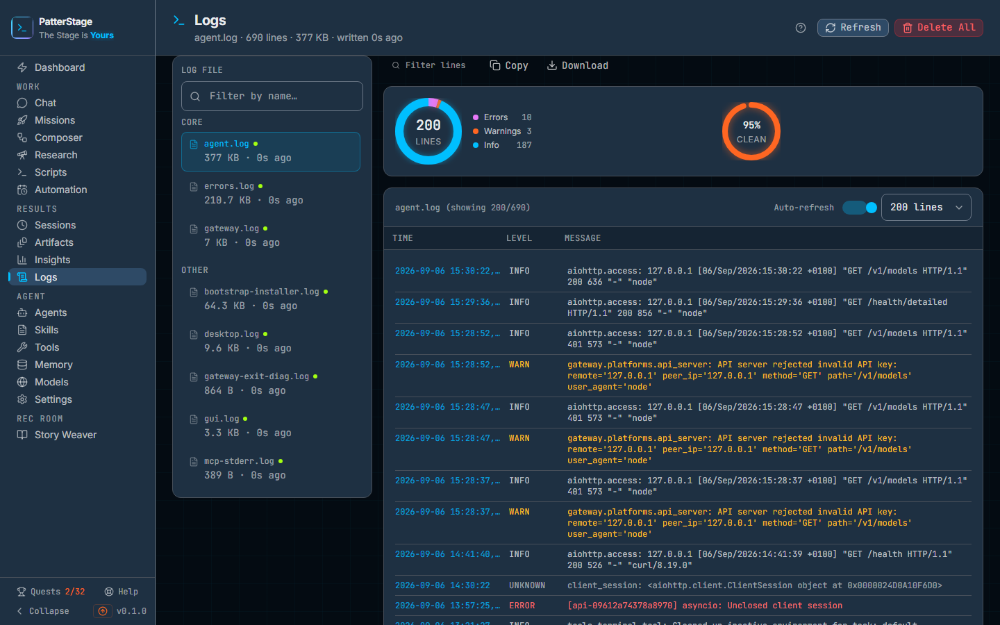

# Logs

This screen reads the log files your agent writes on this machine, one file at
a time, newest line at the top.

## What you see

The header names the file you are reading. Under the title sits a line of
facts about it: the file name, how many lines came back in this read, its size
on disk, and how long ago it was last written to, as in `agent.log · 771 lines
· 414 KB · written 6s ago`. That count is of the block the server read from the
end of the file, not of the whole file. Before a file has loaded it reads
"Hermes agent and gateway logs" instead.

To the right of the header are two controls. **Refresh** fetches the file
again now. **Delete All** is the destructive one, and it asks twice: the first
click changes the button to **Confirm Clear** and puts a **Cancel** beside it.
It is disabled while no log file exists.

The terminal's own bar, under the file name, holds the two controls that are
about the terminal: an **Auto-refresh** switch that turns the five second
refresh on and off, and **Lines to show**, which picks how much of the file to
load: 100, 200, 500 or 1000 lines.

Below the header the screen is in two columns. On a phone, or in a window
narrower than about a thousand pixels, the file list sits behind a **Log
files** button above the terminal instead; choosing a file closes it.

On the left, under the heading **Log file**, is the list of files that exist,
with a **Filter by name…** box above it. Files are grouped under **Core**,
**System** and **Other**, with the agent's own logs first. Each row shows the
file name, its size and how long ago it changed, and a small green dot when it
was written to in the last minute, which is how you spot the file that is
moving right now. When the name filter matches nothing the list says "No
matching log files".

On the right, above the log itself, is a row of actions. **Filter lines**
opens a search box; while it is open it shows a running count of matches and
an X to close it again. **Copy** puts the lines currently on screen on the
clipboard. **Download** saves the loaded lines as a `.log` file. A **Latest
lines** pill appears only once you have scrolled down, and takes you back to
the top.

Under that, once a file with lines is open, is a strip of counts: a ring
divided into **Errors**, **Warnings** and **Info** with the total line count in
the middle, four tiles for the same three numbers plus **Lines**, and a
percentage marked **clean**, which is the share of lines not counted as errors.
Hovering any tile says exactly what it counted.

The log itself is drawn as a terminal pane. Its bar names the file and how much
of it you are looking at, as in `agent.log (showing 200/771)`, and the lines
below sit in three columns: **Time**, **Level** and **Message**, coloured by
level. An empty file reads "Log file is empty"; a filter that matches nothing
reads "No matching lines".

## Typical use

**See what the agent is doing right now.**

1. Pick `agent` in the **Log file** list, or whichever file carries the green
   dot.
2. Leave the auto-refresh button on. The file is fetched again every five
   seconds and the view stays pinned to the newest line.
3. Scroll down to read back through it. Auto-scroll stops while you are
   reading, and the **Latest lines** pill brings you back.

**Find the error behind a failed run.**

1. Set **Lines to show** to 500 or 1000 so the window covers the period you
   care about.
2. Click **Filter lines** and type a word from the failure, a mission name or
   an error code. Only matching lines stay, the match is highlighted, and the
   count beside the box tells you how many there were.
3. Click **Copy** to take those lines with you. Copy takes what the filter has
   left on screen, so you get the lines you are looking at and nothing else.

**Keep a copy, then start the file clean.**

1. Click **Download** to save the loaded lines as `<name>.log`.
2. Click **Delete All**, then **Confirm Clear**. Every log file is emptied and
   the screen reports how many, as in "Cleared 6 log file(s)".

## Notes

- Lines are newest first. This is the opposite of reading the file in a text
  editor, so the top of the pane is the end of the log.
- You are reading a window from the end of the file. The header and the
  terminal bar say how many lines that read pulled back, which on a large file
  is more than the window shows but still less than the file holds, the only
  way to see further back is a bigger **Lines to show**, up to 1000.
- **Copy** and **Download** are not the same selection. Copy takes the filtered
  lines on screen; Download saves the whole loaded window, filter or no filter,
  in the same newest-first order.
- The counts strip covers every loaded line, not the filtered view, so
  filtering narrows the pane without moving the numbers above it.
- Those counts are read off the text of each line, so they are a good guess
  rather than a tally. A line the log itself tagged wins over the words in it,
  and a line saying there were no errors is not counted as one.
- A line that carries no time of its own is shown with the file's last-write
  time, so a block of such lines can read as though it all happened at once.
- **Delete All** empties each file rather than removing it, and it cannot be
  undone. The agent keeps writing to the same files afterwards.
- On a fresh install there are no logs yet. The screen says so in a plain grey
  message, not a red one, and the files appear the first time the agent runs. A
  read that genuinely fails gets a red banner with a **Retry** button.
- Every successful read is recorded on this machine. The first one completes
  the "Read the logs" quest on [Quests](quests.md), and because auto-refresh
  reads the file again every five seconds, a screen left open keeps adding to
  the counts on [Insights](insights.md). Turn the auto-refresh button off if
  you would rather it did not. Nothing about the log's contents is recorded,
  only that a file was read.
- If the logs point at something broken in the install itself, the
  [troubleshooting guide](../running/troubleshooting.md) covers the usual
  causes.

Under the hood

The screen reads `GET /api/logs?name=<basename>&lines=<n>`, which serves files
from the `logs` directory inside the agent's install root. A basename may only
contain letters, digits, dots, underscores and hyphens, and the resolved path
must stay inside that directory, so no name can walk out of it. The server caps
the request at 1000 lines and reads the tail in 64KB chunks from the end of the
file, stopping as soon as it has the lines it was asked for, so a
multi-megabyte log is never loaded whole. The count in the header and the
terminal bar is the number of lines in the chunks that read collected, which is
why it grows with **Lines to show** and stops well short of a long file's real
length.

Grouping in the sidebar is by name: `agent`, `errors` and `gateway` are Core,
anything beginning `ch-` is System, everything else is Other. The green dot
means an mtime inside the last 60 seconds.

`DELETE /api/logs` truncates every log file and answers with the number
cleared; the same route accepts a `name` parameter to clear one file, which
this screen does not use. In read-only mode (`PS_READ_ONLY`) the delete is
refused before the handler runs, and no read event is recorded.

The severity rules behind the counts strip live in
`src/components/logs/log-line-severity.ts`, and the read event is
`logs.opened`, written once per successful file read.

