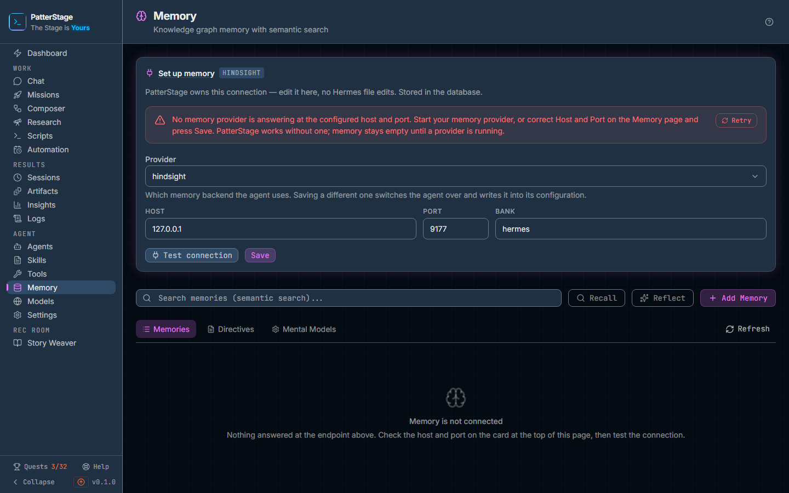

# Memory

This screen browses what your agent has learned between conversations, and it
carries the one connection to the service that stores it.

## What you see

The header reads **Memory**, with "Knowledge graph memory with semantic search"
underneath it.

**The provider card** sits at the top and owns the connection. Its heading is
**Memory provider**, with a small badge naming the provider that is active,
**Hindsight** on a stock install, and a line saying that PatterStage owns this
connection and stores it in its own database rather than in a Hermes file.
Below that are three fields, **Host**, **Port** and **Bank**, filled with
wherever this install is currently pointed, and two buttons, **Test connection**
and **Save**. When a test finishes, its result appears beside the buttons: a
green "Connected" with the status the server reported, or the reason it failed
in pink. A save reports back in the same row.

Two warnings can appear inside that card, and only one at a time.

- If nothing answered, the card's heading changes to **Set up memory** and a red
  banner appears in it, saying no memory provider is answering at the host and
  port configured above, that PatterStage works without one, and that memory
  stays empty until a provider is running. The banner carries a **Retry**
  button.
- If something did answer at an endpoint nobody has confirmed, an orange notice
  says the endpoint is the built-in default and names it. The point it makes is
  worth reading: if another memory service is already running there, the page is
  showing that service's memories rather than yours. Pressing **Save** confirms
  the values and the notice goes away.

**The search row** comes next: a box reading "Search memories (semantic
search)", then **Recall**, **Reflect** and **Add Memory** on the same line.
Pressing Enter in the box runs Recall. Recall and Reflect stay disabled until
the box has something in it.

**A strip of counts** appears once facts have loaded: a ring split into
**Fresh** and **Stale** with a legend naming each count, one tile, **Distinct
tags**, and a second ring giving the share that is fresh as a percentage. When the store holds more than the page that was loaded, a line
underneath says so, as in "Showing the 50 most recent of 17,638 stored facts".

**A reflection panel**, headed **Reflection**, appears above the tabs after
Reflect has run, and holds the answer that came back.

**Three tabs** follow: **Memories**, **Directives** and **Mental Models**. At the
right end of the tab row is a **Refresh** button for the memory list, which
runs your current search again, or reloads the recent facts when the search box
is empty; its tooltip says which of the two it is about to do. The other two
tabs carry their own Refresh button.

On **Memories**, each fact is a card: the text, a badge for the kind of fact it
is, badges for its tags, a **Proof count** when the store recorded one, and how
long ago it was stored. Above the list, when there is
something to say, a strip reports how many memories are hidden for being older
than 90 days, with a **Show stale** button that reveals them and becomes **Hide
stale**.

An empty Memories list says one of four things, and they mean different things:
nothing is connected; the search found no match, with a **Clear search** button
back to the recent list; every stored memory is older than 90 days and the age
filter is hiding them; or there are simply no memories yet.

On **Directives**, a line counts them and says they are injected into agent
prompts automatically, beside **Refresh** and **New Directive**. Each row shows
the directive's name, a priority badge when it was given one, an **Inactive**
badge when it is
switched off, the rule itself, its tags, and three icon buttons: edit, a toggle
that activates or deactivates it, and delete.

On **Mental Models**, a line counts them and describes them as cached reflect
results, beside **Refresh** and **New Model**. Each row shows the model's name,
a **Ready** or **Generating** badge, the query it was built from, the first
lines of what it produced, when it was last updated, its tags, and three icon
buttons: edit, a lightning button that re-runs the query, and delete.

## Typical use

**Point PatterStage at your memory server.**

1. Check **Host** and **Port** against the server you are running. A stock
   Hindsight listens on `127.0.0.1` port `9177`. Change **Bank** only if your
   memories are kept under a name other than `hermes`.
2. Press **Test connection**. A green "Connected" beside the buttons means the
   server answered; anything else names what went wrong.
3. Press **Save**. The endpoint is written to PatterStage's own database, so
   there is no file to edit, and the values stop being a guess. If the probe
   that follows the save finds the store answering, the list below reloads by
   itself.

**Find something the agent already knows.**

1. Type a phrase into the search box and press Enter, or press **Recall**. The
   search is by meaning rather than by keyword, so a question in your own words
   works better than a single term.
2. If nothing matches, the empty state offers **Clear search**, which puts the
   recent list back.
3. Press **Reflect** instead of Recall when you want an answer rather than a
   list. The memory server reads the relevant facts and writes a short response,
   which appears in the **Reflection** panel above the tabs.

**Store a fact by hand.**

1. Press **Add Memory**. A **Store New Memory** box opens.
2. Write the fact under **Memory content**, and add comma-separated **Tags** if
   you want to be able to group it later.
3. Press **Store Memory**. A toast confirms it was stored and the list behind
   the box reloads, running your current search again if you had one.

## Notes

- Memory is optional. With no provider running, everything else in PatterStage
  works, and the **Memory** tile on the [Dashboard](dashboard.md) reads degraded
  rather than down. What you lose is the agent's ability to carry anything
  between conversations. See [memory](../concepts/memory.md) for what that
  means in practice.
- The Memories list loads the 50 most recent facts. The counts strip describes
  that page, not the whole store, which is why the **Facts** tile switches to
  the store's real total and the sentence underneath tells you how many of how
  many you are looking at.
- Facts older than 90 days are hidden until you press **Show stale**. On a store
  that has been running for a while, this is the difference between an empty
  looking page and a full one.
- Memories can be added from this page but not edited or deleted from it.
  Directives and mental models can be: their delete buttons take two clicks, and
  the armed state clears itself after four seconds if you walk away.
- **Reflect** is the expensive control on this page. The memory server has to
  reason over the facts it found, which uses whichever model that server is
  configured with, takes noticeably longer than a recall, and gives up after a
  minute. If it cannot do it, it falls back to telling you how many relevant
  memories it found.
- A directive is a standing rule, not a fact. It goes into the agent's prompts
  every time, so a handful of short ones is worth more than a long list, and the
  toggle lets you take one out of circulation without losing it.
- A mental model is a saved question with its last answer kept alongside it. The
  answer does not update when you edit the question; the lightning button on the
  row is what re-runs it.
- Saving the provider card is what marks memory as configured for the
  "Connect memory" quest, and storing a fact completes "Retain a fact". See
  [Quests](quests.md). An endpoint that PatterStage guessed does not count as
  configured until you have saved it.
- The **Provider** field under Memory in [Settings](settings.md) shows what is
  active and links back here. This page is the only place that changes it.
- If nothing answers and you do not have a memory server yet, the installer
  offers to set one up: see [installing](../start-here/install.md). If one used
  to answer and no longer does, the memory section of
  [troubleshooting](../running/troubleshooting.md) covers the usual causes.

Under the hood

The card reads and writes `GET`/`PUT /api/memory/config`, and **Test connection**
is a `POST` to the same route with `action: "test"`. The active provider row,
its host, port and bank live in the `memory_providers` table in PatterStage's
database; the seeded default is `127.0.0.1:9177` with bank `hermes`, flagged
unconfirmed until a save. A save that switches which provider is active also
writes `memory.provider` into the agent's `config.yaml`, so the agent's own file
agrees with the database. Editing the host, port or bank of the provider that is
already active changes how it is reached rather than which one it is, and leaves
the file alone. Nothing reads that file back to decide which provider is active,
and a file that will not parse is reported on the save rather than overwritten.

Everything below the card goes through `/api/memory/hindsight`, which talks
directly to the Hindsight HTTP server: `list` (50 at a time), `recall`,
`reflect` (a 60 second timeout, at the server's "mid" budget), `health`,
`directives` and `mental-models` on the read side, and `retain` plus the
directive and mental-model mutations on the write side. Storing a fact records
the `memory.retained` event. The stale threshold is
`HINDSIGHT_DEFAULT_MAX_AGE_DAYS`, 90 days, in
`src/lib/memory/hindsight-client.ts`.

Two failure messages are special-cased. A transport error such as `fetch failed`
or `ECONNREFUSED` becomes the plain sentence about nothing answering; an error
mentioning Redis becomes "Start Redis to enable memory features: redis-server".

To run a Hindsight server, `bash scripts/bootstrap/setup-hindsight.sh --docker`
brings up Postgres with pgvector and the Hindsight API in containers, and the
same script without the flag installs it natively on Linux under systemd. For
development there is `npm run mock-hindsight`, an in-memory server on the same
port implementing the same HTTP contract.

