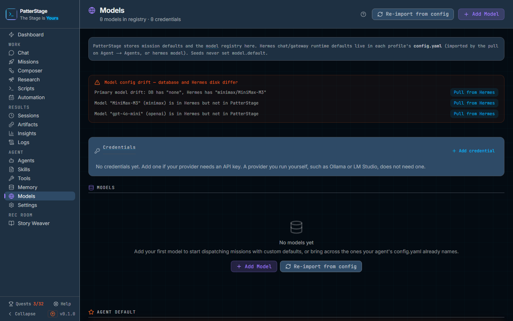

# Models

Models is where you record which language models this install may use, which key
pays for each one, which model does which job, and what happens when the model
you chose will not answer.

## What you see

**The header.** The page title, and under it a count of what the registry holds:
"3 models in registry · 2 credentials". On the right, two buttons.
**Re-import from config** reads the agent's own configuration on this machine
and brings the models and keys it names into the registry. **Add Model** opens
the editor on an empty form.

**The note under the header.** One line saying what this page owns, which is the
model registry and the defaults your missions run on. Each agent profile also
carries its own runtime settings, and those are brought across on the
[Agents](./agents.md) page rather than here.

**The drift banner.** Orange, and only there when the registry and the agent on
disk disagree. It is headed with a sentence saying the two differ, then one line
per disagreement: a model the agent has that the registry does not, a model the
registry has that has never been pushed, or a primary model the two sides name
differently. Each line carries the one direction that resolves it,
**Pull from Hermes** or **Push to Hermes**, and sometimes both. A line with
neither says "Make it the agent default to push it", which is the decision it is
waiting on.

**The summary strip.** Appears once you have at least one model. A ring showing
the mix of providers, up to six of them, with the model count in the middle and
a legend naming each provider and its count, and one tile: Credentials.

**Credentials.** A card listing every key you have stored. Each row shows the
label you gave it, its provider, and a short hint of the key itself, never the
key. On the right, **Rotate key**, which opens a masked box reading "Paste the
replacement key" with Save new key and Cancel beside it, and a bin icon. The
whole card is hidden when you have no credentials.

**Models.** The table, and the heart of the page. Columns are Name, Provider,
Model ID, Protocol, Context, Default For and Actions. Protocol reads `anthropic`
or `openai` where the row records one and `auto` otherwise. Default For carries a
small badge for every task slot this model is the default for, or a dash. The
Actions column holds a down arrow (Pull from Hermes), an up arrow
(Push to Hermes), a pencil to edit and a bin to delete. Both arrows open a panel
listing exactly what would change before anything is written. On a window
narrower than about 1280px the rows stack as cards, each value labelled, so
the actions are never off the edge. With no models at
all you get "No models yet" and the same two buttons the header carries.

**Agent Default.** Two halves in one panel. On the left,
**Bulk Set Auxiliaries**, collapsed, which sets many task slots to one model at
once: a Target Model picker, an ALL or CUSTOM choice, tick boxes for the
individual slots when you choose CUSTOM, and an Apply button that counts what it
is about to change. On the right, **Default Model**, a single picker for the
model that runs your missions. When one is set, its provider and model
identifier appear beside it with a green **Active**; when none is, it reads
"No default set".

**Fallback Chain.** A collapsed section with a count badge. Opened, it shows a
numbered table of the models to try when the first one will not answer, each row
with its position, its name and provider, an Enabled switch, arrows to move it
up or down, a pencil that edits an override base URL for that entry alone, and a
bin. Under the table, **Add from Registry** picks a model you already have, and
**Add Custom** opens a small form for one you do not (Name, Provider, Model ID
and an optional Base URL). Below that sit the settings that govern the chain:
**Retry Threshold**, a number of attempts before falling back;
**Restoration Policy**, either "Restore primary after fallback" or "Stay on
fallback model"; and a tick box, "Notify on fallback activation". Two buttons
close the section, **Sync to Hermes** and **Import from config**.

**Task Defaults.** Twelve cards, one per job the agent farms out, each with a
one-line description of what that job is and a picker for the model that should
do it: Agent, Hindsight, Compression, Vision, Web Extract, Session Search,
Title Generation, Skills Hub, MCP, Triage Specifier, Approval and Delegation.
The Agent card is the same choice as Default Model above, shown here in its
place among the rest.

**The model editor.** A modal titled New Model, or Edit Model with the model's
name. Name, which is a display name and does not have to match anything;
Provider, chosen from the list the agent recognises; Model ID, which is the
provider's own identifier for it; Base URL and Context Length, both optional;
and Credential, where you either pick a key you already have or leave it on
"+ Create new credential" and fill in the Credential Label and API Key fields
that appear underneath. For a provider that needs no key those fields are
labelled optional and say so.

## Typical use

### Add a model and the key that pays for it

1. Click **Add Model**.
2. Give it a **Name** you will recognise in a picker, choose the **Provider**,
   and put the provider's own identifier in **Model ID**.
3. Fill in **Base URL** if this provider needs one, and **Context Length** if
   you want it shown in the table. Both can be left empty.
4. Leave **Credential** on "+ Create new credential" and paste the key into
   **API Key**, or pick a key you have already stored for this provider. The
   dropdown only offers keys belonging to the provider you chose.
5. Click **Create Model**. The modal closes, the row appears in the table, and
   the key is written where the agent can read it as well as stored here. If
   that second write fails, the credential is not kept, so you never end up with
   a key the agent cannot see.

### Decide which model does which job

1. In **Agent Default**, pick your main model under **Default Model**. This is
   the one your missions run on, and the change is saved as soon as you pick it.
2. For the smaller jobs, scroll to **Task Defaults** and set them one at a time,
   or open **Bulk Set Auxiliaries** in the Agent Default panel, choose a
   **Target Model**, leave the mode on ALL, and click Apply to set all eleven at
   once. Choose CUSTOM first if you only want some of them.
3. Each change is confirmed by a message naming the slot. A model that is the
   default for something picks up a badge in the Default For column of the
   table.
4. To clear a slot, set its picker back to ", none, " (the Default Model picker
   above reads ", None, "). The choice is removed from the agent's configuration
   as well, so it stops running the model you have taken away.

### Replace a key that has expired

1. In **Credentials**, find the row and click **Rotate key**.
2. Paste the new key into the box and click **Save new key**. The message
   confirms the new hint, and adds a note when the agent's own copy of the key
   moved with it. A provider that signs in through the agent's command line has
   no copy to move, so no note appears.
3. Every model pointing at that credential keeps pointing at it. This is why
   rotating is worth doing rather than deleting the credential and adding it
   again, which would leave those models with no key at all.

## Notes

- Nothing dispatches until an agent default is set. If missions are failing
  before they get anywhere, this page is the first place to look. See
  [model](../concepts/model.md).
- Opening this page reads; it does not import. **Re-import from config** is a
  deliberate act, and the message afterwards says how many models were brought
  across and how many keys were updated. This matters because the import used to
  run on every load, which quietly undid edits made moments earlier.
- An import will not overwrite a name or a base URL you have changed yourself.
  It tracks what it last wrote, so a value you edited is left alone and a value
  it put there can be refreshed.
- Setting a default changes two things: the registry, and the agent's own
  configuration on disk. If that file cannot be read, the message says so
  instead of claiming success, and the registry change still stands. Repair the
  file and set the default again.
- **Push to Hermes** writes the primary model section, which is the agent
  default and nothing else. That is why a drift line about a model that is not
  your agent default offers no Push: make it the default first, then push it.
- The two directions behave differently in the confirmation panel. A pull
  applies field by field, so you can exclude any individual field with the small
  cross. A push writes the whole section in one go, so the only thing you can
  exclude there is the credential. When the two sides already agree, the confirm
  button stays disabled and the panel tells you there is nothing to do.
- A pull on a drift line about a model the agent has and the registry does not
  runs the import. A pull on a line where the two disagree about the primary
  model sets the matching registry row as your agent default, because importing
  would not have moved it.
- Keys are stored in plain text in your database and mirrored into the agent's
  own environment file, which is how the agent reads them. Nothing on this page
  ever shows a key back to you, only a hint. Bear the storage in mind before
  copying your data directory anywhere. See
  [API key](../concepts/api-key.md).
- Some providers need no key at all. Local and self-hosted ones, and one that
  signs in through the agent's own command line instead, are recognised as
  keyless: the credential dropdown offers "No credential (none needed)" and
  leaving it there is a finished answer, not a step you skipped. The
  command-line one refuses a stored key outright and says why.
- Deleting a credential is two clicks: the bin arms, then a tick confirms, and
  the armed state clears itself after about four seconds if you do nothing. The
  message afterwards names any models left without a key, and says whether the
  agent's copy was removed or kept because another credential for the same
  provider still needs it. Deleting a model is the same two clicks.
- A model is called directly when it has both a base URL and a key. Otherwise
  the call goes through the agent's own gateway. This is what the Protocol
  column is about. `auto` is what an imported model reads, because the import
  leaves the protocol unrecorded and it is worked out from the provider and base
  URL when the call is made. A model you add here is given one at the moment you
  create it, so it reads `anthropic` or `openai`.
- The fallback chain saves as you go. Adding, reordering, enabling and deleting
  each take effect immediately and are mirrored to the agent as they happen; the
  three settings save themselves shortly after you stop changing them.
  **Sync to Hermes** writes them again and reads the file back to check they
  stuck, which is worth doing if you are unsure. **Import from config** goes the
  other way and brings across a chain the agent already has. A chain with no
  enabled entries writes nothing.
- If the registry cannot be read, a banner at the top of the page carries the
  error. Reload the page to try again. The drift banner, the fallback chain and
  the fallback settings are read separately and are allowed to fail on their
  own, so losing one of them does not cost you the rest of the page.
- A mission records the model you picked for it, but what actually answers is
  decided by the agent profile it runs under. If you need a different model for
  real, change it here or on the profile rather than only on the mission. See
  [Missions](./missions.md) and [Agents](./agents.md).
- This page costs nothing by itself. What you pay is what your providers charge
  for the calls these models make; see [spend](../concepts/spend.md).
- Every write to the agent's configuration takes a backup first. See
  [Backup and restore](../running/backup.md).

Under the hood

The registry is SQLite, in the `models`, `credentials`, `model_defaults`,
`model_fallbacks` and `fallback_config` tables from the baseline migration.
Migration `039_models_origin.sql` added `origin`, `last_imported_name` and
`last_imported_base_url`, which is how an import tells your edit from a value it
wrote itself. The twelve task slots are rows in `model_defaults`, keyed on the
task type.

The page loads with one parallel read: `GET /api/models`, `/api/credentials`,
`/api/models/defaults`, `/api/models/sync/drift`, `/api/models/fallbacks` and
`/api/models/fallbacks/config`. The last three are best-effort and fail
individually. Writes go to `POST /api/models`, `PUT /api/models/[id]`,
`DELETE /api/models/[id]`, `POST /api/credentials`,
`PATCH /api/credentials/[id]`, `DELETE /api/credentials/[id]`,
`PUT /api/models/defaults`, `POST /api/models/import`,
`POST /api/models/sync/push`, `POST /api/models/sync/pull`, and
`POST /api/models/fallbacks` with an `action` of add, toggle, reorder, custom,
import or sync. The panel behind each sync arrow is
`POST /api/models/[id]/diff`, which
compares the row against the section the sync would actually touch; when that
route is unreachable the panel still opens and still syncs, but it describes the
call rather than the difference.

Two files on disk are involved, both under `~/.hermes`. An agent default writes
`model.default`, `model.provider`, `model.base_url` and `model.context_length`
into `config.yaml`, and each auxiliary slot writes the matching entry under
`auxiliary`. The `api_key` field in that file is always written empty, because
the key belongs in `.env` under the provider's own variable
(`ANTHROPIC_API_KEY`, `OPENAI_API_KEY`, `OPENROUTER_API_KEY` and so on). A
provider that authenticates by OAuth has no variable at all, which is why
storing a key for it is refused rather than silently dropped. The fallback chain
is written as `fallback_providers`, and its three settings as
`agent.api_max_retries`, `agent.restore_primary_on_fallback` and
`agent.fallback_notification`, each read back after the write. Clearing a slot
deletes the corresponding keys rather than leaving them behind.

The provider list mirrors the agent command line's own `--provider` choices,
plus the direct-call providers, and lives in one file so that teaching
PatterStage about a new provider is a single edit.

