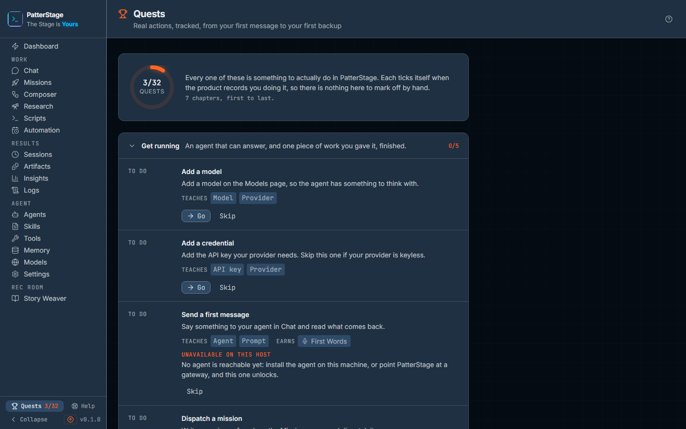

# Quests

Quests are the product's answer to "what should I do next?". There is nothing
to tick off by hand: each one watches for something you were going to do
anyway, and marks itself when the product records you doing it.

## What you see

**The header.** A trophy, the word Quests, and a line reading "Real actions,
tracked, from your first message to your first backup". On the right, a **?**
that opens this guide.

**The summary.** A ring showing how many quests you have finished out of how
many are counted, with the word "quests" beneath the number. Next to it, a
sentence saying that every one of these is something to actually do in
PatterStage and that each ticks itself when the product records you doing it,
then a line counting the chapters: seven, first to last.

**Seven chapters**, stacked under the summary. Each is a folded row carrying a
chapter title, one sentence saying what you can do once it is finished, and its
own count on the right. Click the row to open or fold it. Chapter 1, **Get
running**, opens itself when it still has something left in it, and folds away
once it is complete. In order, the seven are Get running, Missions, Shape your
agent, Automate and watch, Multi-stage work, Rec Room and Keep it healthy.

**A quest.** Open a chapter and each quest inside it is a row, the rows
divided by thin rules rather than boxed:

- A marker in small capitals reading **To do**, **Complete** or **Skipped**, in
  a column of its own down the left, so every title starts at the same edge.
- The quest's name, and on a finished one, the date it was first seen done.
- One sentence saying what to do, naming the screen it happens on: "Add a model
  on the Models page, so the agent has something to think with."
- **Teaches**, followed by chips naming the ideas the quest introduces: Model,
  Provider, Mission, Schedule, Gate, Artifact and the rest.
- **Earns**, followed by a chip naming the achievement, on the four quests
  that unlock one; it lights orange once earned.
- A **Go** button that opens the screen where the action happens, and beside
  it **Skip**, or **Unskip** on one you have already skipped.

**A quest this machine cannot run.** In place of Go, a line headed
"Unavailable on this host" with one sentence naming what is missing, and for
most of them what would change it: no agent is reachable, no memory provider is
reachable, the Composer is switched off on this install, or host script
scheduling that native Windows does not have. The row still shows, it still
keeps its place in the count, and it never claims to be complete.

**While the read is in flight**, the header is drawn and the body is a
skeleton the shape of the list.
If that read fails, a banner naming the failure with a **Retry** button and a
note that your progress comes from the same poll the dashboard uses and nothing
has been lost. You are never shown a page of zeros instead.

**If a skip cannot be saved**, a line appears above the chapters naming the
failure and stays there. It does not fade, because the control you just pressed
would otherwise look as though it had simply done nothing.

## Typical use

**Do the next thing.**

1. Open Quests. Chapter 1 is already open unless you have finished it.
2. Read the first row marked **To do** and press **Go**. You land on the screen
   the sentence describes.
3. Do the thing. There is nothing to come back and tick. The next time the
   console reads your progress, up to twenty seconds later, the row turns
   **Complete**, stamps today's date, and a message reading "Quest complete:"
   with the quest's name appears in the corner.

**Skip one that does not apply to your install.**

1. Find the row. "Add a credential" is the usual one: a local provider that
   needs no API key makes it impossible rather than merely undone.
2. Press **Skip**. The row dims and its marker changes to **Skipped** at once;
   the totals at the top and on its chapter each drop by one the next time your
   progress is read, so the number stays a description of what you still mean to
   do.
3. Press **Unskip** on the same row to put it back into the count.

**See what a chapter is going to ask of you.**

1. Click a chapter's row to open it.
2. Read the sentences. Each names the screen it happens on, and the Teaches
   chips name what it introduces you to.
3. Press **Go** on whichever one you want. Nothing here is ordered and nothing
   is a prerequisite, so you can start in chapter 5 if that is the work you have.

## Notes

Quests gate nothing. No feature waits on one, nothing unlocks, and skipping the
lot costs you only the reminder. They exist because a console with this many
screens has a discovery problem, not because your work needs a score.

Nothing on this page can be ticked by hand. Each quest names a fact the server
already holds and completes when that fact appears, which means work you did
before you first opened this page already counts. The first evaluation on a new
install is deliberately quiet: everything you have already done is marked done
without a queue of notifications for your own history.

Once a quest is complete it stays complete. The moment it was first seen done is
written down and never rewritten, so old sessions ageing out of the database can
never take a finished quest back off you.

The completion message appears wherever you are in the console, not only on this
page, and each quest announces itself at most once per visit. A skipped quest
never announces anything.

The rail carries your progress beside the Quests link, how many you have
finished out of how many are counted, as a count when the rail is wide and a
dot when it is collapsed to icons. It disappears
entirely once there is nothing left, and the [Dashboard](dashboard.md) shows the
single next quest you can attempt on its Start here card.

A quest that this machine cannot attempt stays in the total. The denominator
describes the whole programme, not whether a gateway happens to be answering
this minute, so a count that shrank when a subsystem went down would be telling
you the programme had got shorter. For the same reason, a status check that has
not answered yet is treated as though everything is available: an unavailable
quest is a claim, and the page only makes it once something has actually said so.

Two quests prove something slightly narrower than they ask. "Use a template" is
proved by a second dispatch, because the record counts dispatches and does not
note where a prompt came from. "Read a transcript" is proved by a session
arriving, because opening a page is not something PatterStage writes down.
Reading an artifact and opening a log file are the exceptions: each records an
event of its own.

The page itself makes no model calls, so leaving it open costs nothing. Doing
the quests costs whatever the underlying action costs, at the rate of whichever
model runs it.

The badges shown under **Earns** mirror the quest beside them. The full ledger
of achievements, with everything else you can unlock, lives on
[Insights](insights.md). Every quest, its exact proof and the screen it belongs
to are listed in the [quest reference](../reference/quests.md). If you would
rather be walked through the first few by hand, the [first hour](../start-here/first-hour.md)
covers the same ground in prose, and the last chapter's one quest is explained
in full under [backups](../running/backup.md).

Under the hood

Progress is evaluated inside the `/api/stats` read the shell already makes every
20 seconds, so this page adds no endpoint and no request for the part that
decides whether a quest is done. It does make three reads about the host rather
than about progress: `/api/status/subsystems`, `/api/status/runtime` and the
feature flags, which is how it knows whether the gateway, a memory provider, the
Composer and a host scheduler are present. Those four answers decide whether the
nine quests that ask something of the host are attemptable here.

The high-water mark is kept in the operator preferences table as
`quests.completedAt`, a map of quest id to the ISO time it was first seen
complete, alongside `quests.skipped`, an array of ids. Skip and Unskip write the
array through `PUT /api/prefs`, which validates it against a six-key allow list;
an install running read-only refuses the write, which is the failure the
persistent line reports. An id in either structure that this build no longer
defines is carried through untouched rather than deleted.

The Composer is switched on and off by `PS_COMPOSER`. Host script scheduling is
unavailable on native Windows; running under WSL2 restores it, and
[host scheduling](../running/host-scheduling.md) covers the detail.

The thirty-two definitions live in `src/lib/quests/quest-defs.ts` as data, and
the reference ledger is generated from that same file, so the two cannot drift.

