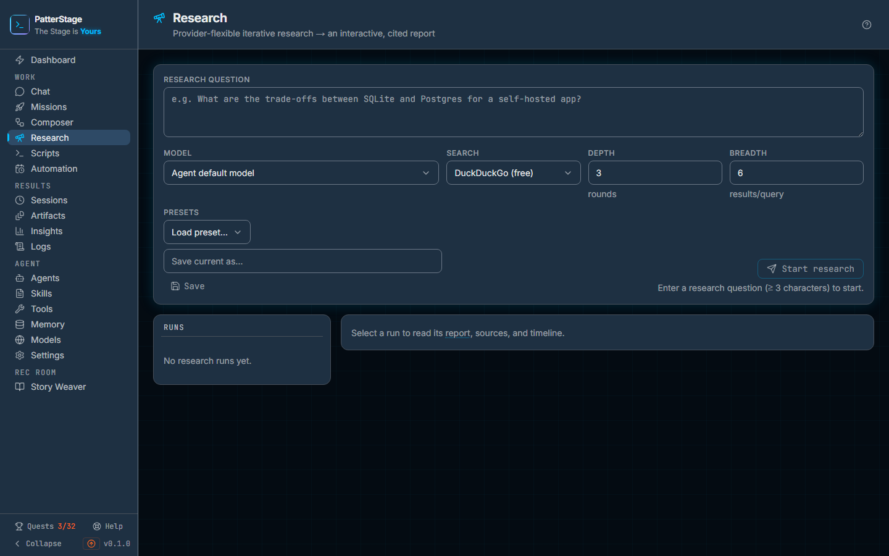

# Deep Research

Ask a question in plain language and the agent goes off to search, read and
think for you, then writes back a report with every claim linked to the page it
came from.

## What you see

The page sits at **Work → Research** in the left rail. Everything at the top of
it is the form that starts a run.

**Research question** is a three-line box with an example question showing in it
as a placeholder. Under the box is a row of four settings:

- **Model** chooses what does the thinking. The first entry, **Agent default
  model**, uses whatever your agent already runs on. Below it is every model you
  have registered, each listed as its name and its provider.
- **Search** chooses where the evidence comes from. **DuckDuckGo (free)** needs
  no setting up at all. **SearXNG (local)** uses a search instance you run
  yourself. **No web (model only)** turns searching off, and the report is
  written from the model's own knowledge.
- **Depth**, hinted **rounds**, takes a number from 1 to 8 and starts at 3. It
  is how many times the run searches, reads and thinks again before writing.
- **Breadth**, hinted **results/query**, takes a number from 1 to 12 and starts
  at 6. It is how many results each search asks for.

Under those sits **Presets**, a **Load preset…** picker of configurations you
have saved, next to a **Save current as…** name box and a **Save** button. On
the right of the same row is **Start research**. Until the question is at least
three characters long that button stays disabled and a line under it reads
"Enter a research question (≥ 3 characters) to start."

The rest of the page is two panes side by side. On a phone, or in a window
narrower than about a thousand pixels, the runs sit behind a **Runs** button
above the report instead; choosing one closes it.

**Runs** on the left lists your research runs, newest first, up to fifty. Each
row shows the first line of the question and, under it, the run's state in
capitals: pending, running, completed, failed or cancelled. Before you have run
anything it reads "No research runs yet."

The pane on the right is whichever run you selected. Until you pick one it reads
"Select a run to read its report, sources, and timeline." Once a run is selected
it shows, from the top:

- the full question, the state, and, while the run is still pending or running,
  a **Stop run** button;
- a line of facts about the run: Model, Search, Depth, Breadth, Duration and
  Tokens. Duration reads "running" until the run ends, and Tokens reads "not
  recorded" when no model reported any;
- the run's error, when it has one;
- **Copy**, **View report** and **Download**, once there is a finished report;
- **In brief**, a highlighted band of three to five bullets carrying the whole
  answer;
- **On this page**, a row of links to the report's own headings;
- the report itself, with every **[n]** citation clickable;
- **Sources (n)**, numbered to match those citations, each showing the site it
  came from and the full address underneath;
- **Research timeline**, a stepper of everything the run actually did, labelled
  Plan, Search, Read, Reason and Synthesize. Each entry expands to show what it
  produced. While the run is live the newest one is already open and a
  "working…" line pulses under the list.

A read or a write that fails puts a banner across the top of the page saying
what went wrong.

## Typical use

**Ask a question and read the answer.**

1. Type the question into **Research question**. A question with a shape to it
   works better than a bare topic, because the plan step turns it into
   sub-questions to chase.
2. Leave **Model** on **Agent default model** and **Search** on **DuckDuckGo
   (free)** for a first run.
3. Click **Start research**. The run appears at the top of **Runs** and selects
   itself, and the timeline fills in step by step as it goes. You can leave the
   page or close the tab; the run carries on without you.
4. When the state reads completed, read **In brief** first, then use **On this
   page** to jump to the section you want. To check a claim, click its **[n]**
   and you jump to its numbered entry in **Sources**, where the link opens the
   page it came from.

**Save a configuration you want again.**

1. Set **Model**, **Search**, **Depth** and **Breadth** to what you want. Depth
   5 or 6 with breadth 8 is a slower, wider run; depth 1 is close to a single
   search and a summary.
2. Type a name into **Save current as…** and click **Save**.
3. Next time, pick it from **Load preset…** and the fields fill themselves in.
   Loading a preset changes the form and starts nothing.

**Stop a run you no longer want.**

1. Select the run while it is still pending or running.
2. Click **Stop run**. The button changes to **Confirm stop?**.
3. Click it again within a few seconds. The run reads cancelled, keeps the steps
   it had already reached, and records no report. If you leave it, the button
   goes back to **Stop run** on its own.

## Notes

Depth is what a run costs. Each round is one search and one round of thinking,
on top of one call to plan at the start and one to write the report at the end,
so a run at depth 8 makes about twice the model calls of one at depth 3.
Breadth widens each search rather than adding calls. Depth is a ceiling, not a
quota: after each round the model either asks for another search or declares
itself done, so a run set to 8 can finish in three rounds and often will. The
token total for a finished run is on
the run's own line of facts, and Deep Research is one of the sources broken out
in the spend panel on [Insights](./insights.md). See
[Spend](../concepts/spend.md) for how that total is arrived at, and
[Model](../concepts/model.md) for what your choice in the Model dropdown
actually changes.

Every round opens the top two results and reads the pages behind them, and that
number is fixed for runs started from this page. Breadth still matters: every
result a search returns is carried into the final write-up as a numbered source,
which is why the **Sources** list is longer than the pages the timeline shows
being read. When no page in a round could be opened, that round reasons over the
search snippets instead.

A finished report is kept as an artifact, named after the question, so it
outlives the run and turns up on [Artifacts](./artifacts.md) alongside
everything else your agents produced. A cancelled run leaves no artifact: half a
report is not a deliverable. **Copy** puts the report on your clipboard as
Markdown; **View report** opens a self-contained page with the report, the
sources and the timeline on it; **Download** saves that same page as a file you
can send to someone who does not have PatterStage.

If some of the evidence could not be gathered, the report opens with a note
saying so, counting the searches that failed and the pages that could not be
read, and telling you to treat its coverage as partial. A clean run gets no such
note, which is what makes it worth reading when it appears.

If every single search fails, the run is marked failed rather than completed,
and its error says the report was written with no external sources and its
claims are ungrounded. A search that legitimately finds nothing is a different
thing: that run completes, and the report says it answered from the model's own
knowledge.

Choosing **SearXNG (local)** without an instance to point at falls back to
DuckDuckGo silently, so a run you meant to keep on your own machine can leave
it. Set the address first, and confirm afterwards by reading the Search fact on
the finished run, which records the provider that was actually used.

Pages that will not open are skipped rather than fatal. A fetch gives up after
twelve seconds, reads roughly the first six thousand characters, and refuses
addresses on your own machine or network. A page that is paywalled, blocked or
slow is counted towards the incomplete-evidence note, and the round carries on
with what the search results said.

A run interrupted by a restart is not left spinning. Anything still marked
running more than thirty minutes after it started is failed the next time
PatterStage boots, with an error saying it was interrupted.

Presets can be saved and loaded here but not deleted here.

Research is also a stage you can put inside a workflow. A **research** node in
[Composer](./composer.md) runs the same engine as part of a longer process, so
if research is the first step of something bigger, build it there rather than
starting from a report.

Under the hood

The screen is `src/app/work/research/page.tsx`. The loop lives in
`src/lib/laboratory/deep-research/engine.ts`, which calls inference through
`callLLM`, so a run can use the Hermes gateway default or any registered model
pointing at a local endpoint or a cloud provider. Search is the shared
`src/lib/search/` module, which Composer's research stage uses too.

| Route | What it does |
|---|---|
| `GET /api/laboratory/research` | Lists runs. Limit defaults to 50 and is capped at 500. |
| `POST /api/laboratory/research` | Starts a run from `{ query, config? }`. Every option lives inside `config`, and both schemas are strict, so a stray or top-level key is a 400 rather than a field that is quietly ignored. |
| `GET /api/laboratory/research/[id]` | Returns one run with its steps. |
| `GET /api/laboratory/research/[id]/events` | Live updates over SSE. The page falls back to polling every three seconds, and shows a "Live updates" banner if the stream itself fails. |
| `POST /api/laboratory/research/[id]/cancel` | Stops a run. 404 for an unknown id, 409 for one that has already finished. |
| `GET /api/laboratory/research/[id]/export` | The standalone HTML report, sent inline so it opens in the browser. |
| `GET`, `POST`, `DELETE /api/laboratory/research/presets` | Lists, saves and deletes saved configurations. Delete needs an `id`. |

`config` carries one option the page has no field for: `visitsPerRound`, the
pages opened per round, which the API accepts between 0 and 6. The page always
sends 2, though a preset created through the API can carry another value and
will be applied when you load it.

Set `PS_SEARCH_PROVIDER` to `duckduckgo`, `searxng` or `none` to choose a
default provider, and `PS_SEARXNG_URL` to the base URL of your own SearXNG
instance. With the URL set and no provider named, SearXNG is preferred
automatically; a per-run choice on the page overrides both. See
[Environment variables](../running/env-reference.md).

Runs, steps and presets live in `research_runs`, `research_steps` and
`research_presets`. Migration `019_deep_research.sql` created the first two,
`023_research_options.sql` added the saved configurations and recorded each
run's own options on it, `034_research_usage.sql` added the token totals, and
`036_research_gather_health.sql` added the four counters behind the
incomplete-evidence note. A null token total is stored as null rather than zero,
because a run whose cost was never reported is not a free one.

The job is fire and forget, so nothing in the process resumes it after a crash.
`failStuckResearchRuns()` runs from `src/instrumentation.ts` at boot and fails
every run left `running` past the deadline, Composer-spawned ones included. A
Composer research node is additionally capped by that engine, which force-fails
the node-run at twenty minutes.

