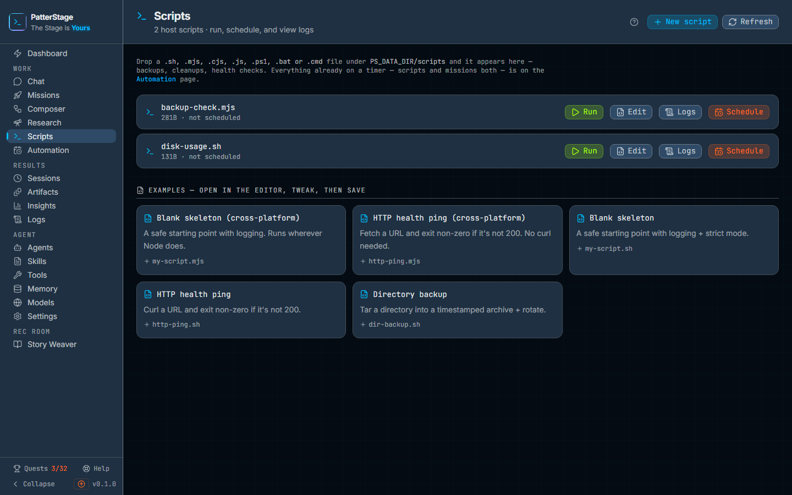

# Scripts

Scripts lists the small programs that live on this machine, so you can write
one, run it by hand, read what it printed, and put it on a timer.

## What you see

The header names the page and counts what was found, for example "4 host
scripts", with two buttons beside it. **New script** opens the editor on a
two-line bash starting point, a `#!/usr/bin/env bash` shebang and
`set -euo pipefail`, which you can replace outright. **Refresh** re-reads the
folder, which the page also does on its own every thirty seconds.

Under the header, one line names the seven kinds of file the page picks up:
`.sh`, `.mjs`, `.cjs`, `.js`, `.ps1`, `.bat` and `.cmd`. Any file with one of
those endings, sitting in the scripts folder of your data directory, appears in
the list. The same line points at [Missions](missions.md), which is where
agent work goes on a timer rather than host work.

Then the list itself, one row per file. Each row shows the filename, and beneath
it the file's size, then either the schedule as five cron fields or "not
scheduled". Where PatterStage is holding the timer rather than the machine, the
row adds "Runs while PatterStage is running". The row then ends with how the
last run went: "ran 3h ago", "failed 3h ago (exit code 2)", or "did not start
3h ago". Where there is no recorded run to describe the latest output, the row
shows "last run 3h ago" instead, which is the log file's own timestamp and says
nothing about how the run went. That is what you see for a script whose last
run predates this record, and for one the machine's own crontab fired, which
PatterStage never sees.

Four buttons sit at the right of every row:

- **Run** runs the script now.
- **Edit** opens the file in the editor.
- **Logs** shows what the script has printed.
- **Schedule** puts it on a timer. Once it is on one, that button reads
  **Unschedule** instead. Everything already on a timer, scripts and missions
  together, is listed on [Automation](automation.md).

If the folder is empty, the list is replaced by "No scripts yet" and a line
suggesting you create one, install an example, or drop a file in yourself.

At the foot of the page is a row of example cards, which open in the editor
rather than writing anything to disk. There are five: a blank skeleton and an
HTTP health ping as `.mjs` files, which run anywhere, and a blank skeleton, an
HTTP health ping and a directory backup as `.sh` files. Each card gives the
filename it will suggest.

Three windows open over the page.

**The editor** has a Filename field when the script is new, with the rest of the
window given to the text of the script. Tab inserts two spaces, Ctrl or Cmd with
S saves, and a line under the text counts lines and bytes. The footer holds
Cancel and Save, and, for a file that already exists, a Delete that asks a
second time before it acts.

**The logs window** shows the tail of the script's output, or says there is none
yet and that you should run the script first.

**The schedule window** names the script, says in one sentence where the
schedule will be kept and what that means, and offers a picker: a dropdown of
presets grouped into Interval, Daily, Weekly and Monthly, a custom builder for a
time and a set of days, the resolved cron expression, and the next three times
it would fire. A collapsible field takes a raw cron expression if you would
rather type one.

## Typical use

### Write a script and save it

1. Click **New script**, or click an example card to start from something that
   already works.
2. Give it a filename. A name that already ends in one of the seven kinds is
   kept as it is; a bare name is saved with `.sh` on the end.
3. Write the script and click **Save**, or press Ctrl or Cmd with S.
4. The window closes and the file appears in the list. A file created this way
   is marked executable where the operating system has such a mark.

### Run it once and read what happened

1. Click **Run**. The button shows a spinner while the script runs, and the
   page waits for it to finish.
2. A message reports one of three things: that it ran, that it failed and with
   which exit code, or that it did not start at all and why. Only the middle
   one sends you to the logs, because it is the only one that produced any.
3. Click **Logs**. Each run is appended under a dated separator line, so the
   most recent run is at the bottom.
4. The row itself keeps the answer after the message has gone, so you can come
   back tomorrow and see whether last night's run worked.

### Put it on a timer

1. Click **Schedule**.
2. Read the sentence at the top of the window: it tells you whether this
   machine will run the script on its own, or whether PatterStage will run it
   and therefore has to be running itself.
3. Pick a preset, build a custom time, or type a cron expression. Check the
   three preview times underneath, which are worked out by the same code that
   fires the schedule.
4. Click **Schedule**. The row now shows the expression, and the button beside
   it becomes **Unschedule**.

## Notes

**What actually runs your script.** The file ending decides the interpreter.
`.mjs`, `.cjs` and `.js` run under the same Node that PatterStage runs under, so
they work everywhere. `.sh` needs bash. `.ps1` needs PowerShell. `.bat` and
`.cmd` run only on Windows. If nothing on the machine can run that kind of file,
Run says the script did not start and names the kind of file nothing here runs.
That is a different answer from a script that ran and failed, and deliberately
so: a script that never started has no exit code and printed nothing. The
reason is written into the log as well, under the run's separator line.

**Scheduling on native Windows.** Windows without WSL2 has no host scheduler
PatterStage can write to, so schedules made here are kept by PatterStage and
fired by PatterStage. They run only while the app is running, and the row says
so. On Linux and macOS the schedule goes to the machine's own crontab and fires
whether the app is up or not. If a script has to run on a Windows machine
whether or not PatterStage is up, run PatterStage under WSL2. See
[Cross-platform](../running/cross-platform.md).

**Two homes, one row.** A script can only be shown as scheduled once, and the
machine's own schedule wins where both exist. Unschedule asks the row which of
the two is holding it, so one click is enough either way.

**Unschedule before you delete.** The editor warns that deleting a scheduled
script takes its schedule with it. What deleting actually removes is the file.
A timer left pointing at a file that has gone will still come due, fail, and
record the failure. Click **Unschedule** first, then delete.

**Two scripts can share one log.** The log is named after the script without its
ending, so `backup.sh` and `backup.mjs` would write into the same one. Give
scripts distinct names.

**Output arrives at the end, not as it goes.** A run is not streamed. Nothing
reaches the log until the script exits, and a run is cut off after ten minutes.
A script that prints a very large amount of output will be stopped as well, so
write to a file of your own if you need volume.

**Scheduled runs appear here too.** Whether the machine's crontab or
PatterStage fires it, the output lands in the same log, so **Logs** and the row's
last-run line cover scheduled runs as well as ones you started. A run PatterStage
fired on its own timer is recorded whichever way it went, so a backup that failed
last night says so on the row this morning. A run the machine's own crontab
fired is not: nothing of PatterStage is in that path, so the log is all there is. The
[Logs](logs.md) screen reads the agent's own log directory, which is a
different place, a script's output is only visible through the **Logs** button
on its row.

**A fresh install is not empty.** Setting up PatterStage copies its own bundled
maintenance scripts into the folder, including a database backup, a disk report,
a health check, a log rotation and a system report. Those are ordinary scripts:
read them, run them, schedule them, or delete the ones you do not want. The
backup one is described in [Backups](../running/backup.md).

**Related reading.** [Schedule](../concepts/schedule.md) explains what a timer
records and how missed occurrences are handled. [Missions](missions.md) is the
place for agent work on a timer; this page is for work on the machine.

Under the hood

| Thing | Where |
|---|---|
| Script folder | `PS_DATA_DIR/scripts`, or `PS_SCRIPTS_DIR` when set |
| Run logs | `PS_DATA_DIR/logs`, or `PS_HARDWARE_LOG_DIR` when set, one `<name>.log` per script |
| List, with schedule and last run | `GET /api/scripts` |
| Read, write and delete a file | `/api/scripts/[name]` |
| Run now | `POST /api/scripts/run` |
| Tail the log | `GET /api/scripts/logs` |
| Machine schedule | `/api/cron/hardware`, which writes the user crontab |
| PatterStage schedule | `/api/schedules`, fired by the app's own scheduler tick |

A script name may contain letters, digits, dashes, underscores and dots only,
with no directory part, and the resolved path must sit directly in the scripts
folder. Execution goes through the interpreter for the file ending with no
shell and no caller-supplied arguments, so there is nothing for a crafted name
to inject into. The editor accepts up to 256 KB per file, a run is given ten
minutes and an 8 MB output buffer, and the logs window shows the last 400 lines.

Two settings switch this page off. With `PS_READ_ONLY` set, saving, deleting,
running and scheduling are all refused with an explanation. With
`PS_AUTH_MODE=none`, saving, deleting, running a script and writing a machine
schedule are refused, because a script is code the host executes and an
unauthenticated install must not be able to write it. A PatterStage-held
schedule, the native-Windows path, is not yet covered by that refusal.
Reading the list, a file and a log stays available in both cases.

The list is every file with a known ending that is actually in the folder, not a
registry, so a file copied in by hand appears on the next refresh, and a file
removed by hand disappears the same way. How the last run went comes from the
[analytics ledger](../reference/analytics-events.md), which records every run
PatterStage starts, by hand or on a timer, and survives the log being cleared.
The fallback "last run" time is the log's modification time, which is a proxy
rather than a record: clearing the log clears it.

