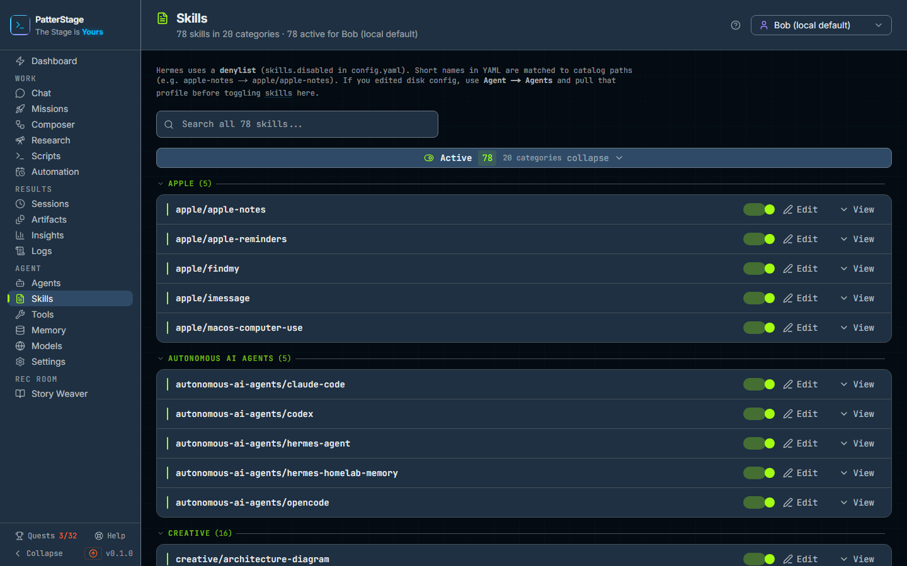

# Skills

Every skill installed on this machine, in one list, with a switch on each one
saying whether the profile you have selected is allowed to use it.

## What you see

At the very top, a small line recording the last thing that happened on this
page, such as "Saved at 14:03: apple-notes enabled". It is not there until you
have done something.

The header carries the page name and one line of counts: how many skills are
in the catalogue, how many categories they fall into, and how many are active
for the profile named at the end of it. On the right is the profile picker
every Agent screen shares. It decides whose switches you are looking at, and
switching profile reloads the whole list.

Under the header, a standing note explaining how the switching works: the agent
keeps a list of the skills that are turned **off**, not a list of the ones that
are on, and a short name in that list is matched to its place in the catalogue
(so `apple-notes` means `apple/apple-notes`). It ends by saying that if you have
edited the agent's configuration by hand, you should pull that profile in on the
[Agents](./agents.md) screen before toggling anything here. The word "skills" in
that note carries a dotted underline: pressing it opens a small box with a
one-line definition and a link to a longer one.

Below the figures, one search box, labelled with the size of the catalogue, for
example **Search all 178 skills...**.

Then the list itself, in two halves:

- **Active**, everything the selected profile may use.
- **Inactive**, everything it may not. This half is not drawn when there is
  nothing in it.

Each half is a header row with a count badge, the number of categories inside
it, and the word "collapse" or "expand" on the right. Inside a half, each
category is a row: an uppercase name, the number of skills in it, and a
chevron. While the half is small enough to show in full (about a hundred
skills) every category starts open with its skills under it, so the skills
themselves are what you see first. Beyond that the categories start closed and
open one at a time. Changing profile puts the defaults back.

A category shows up to 24 skills at a time. When there are more than that, a
line under them says which you are looking at ("1-24 of 60"), with the page
number and **Prev** and **Next** beside it.

A skill is one row: a green mark when it is on, its name, its description with
the full text on hover, a switch that is on when the skill is, and two
buttons:

- **Edit** opens the skill's own text in a box you can change.
- **View** opens a preview of the same text under the row. The button becomes
  **Hide** while it is open.

Typing in the search box replaces both halves with a line saying how many matched
out of how many were searched, and under it a flat list of matching rows, active and
inactive together, each naming its category. The rows behave exactly as they do
in a category, and page the same way. Nothing matching gives you **No skills match**.

With nothing in the catalogue at all, the page is a single panel, **No skills in
catalog**, with an **Import skills from Hermes** button that reads the agent's
own skills folder and fills the list.

## Typical use

**Turn a skill off for one profile.**

1. Choose the profile in the picker at the top right.
2. Find the skill, either by opening its category under **Active** or by typing
   part of its name into the search box.
3. Click the switch on its row. The row shows "Updating…" for a moment, a
   message confirms the change, and the skill moves to the **Inactive** half.
   There is no save button: the agent's own configuration is rewritten as you
   click.

**Find a skill when you only half remember its name.**

1. Type any part of the name or the description into the search box. The search
   runs over the whole catalogue, not over the categories you happen to have
   opened, so a match three pages deep inside a closed category still comes back.
2. The results say how many matched out of the full count. Each row names its
   own category, so you can see where the skill lives.
3. Toggle, view or edit it from the result row. Clearing the box puts the two
   halves back as they were.

**Read what a skill actually tells the agent to do.**

1. Press **View** on its row. The row grows a scrolling preview of the skill's
   instructions.
2. Press **Edit** instead if you want to change them. The box is titled with the
   skill's name and holds its text; **Reset** puts back what you opened,
   **Cancel** closes without writing, and **Save** writes the file and updates
   the catalogue.
3. **Reset** and **Save** stay greyed out until you have actually changed
   something.

## Notes

**One catalogue, one set of switches per profile.** The list of skills is shared
by every profile on this machine. What is not shared is which of them are
allowed: the switches you see belong to the profile in the picker, so the same
skill can be active for one profile and inactive for another, and switching
profile changes the switches without changing the list.

**Editing is shared too.** A skill's text is a single file used by every profile,
so a change you save on this page applies everywhere. If you want one profile to
behave differently, switch the skill off for that profile rather than editing it.

**A new skill arrives switched on.** Because the agent tracks what is turned off
rather than what is turned on, anything added to the catalogue is active by
default for every profile until you turn it off.

**Toggles apply immediately, and say so when they fail.** Each click writes
straight through to the agent's configuration for that profile, with a backup of
the previous version kept. If the write fails, the switch flips back and a
message names the failure. One failure is worth reading closely: if the change
was recorded here but the push to the agent's own configuration did not complete,
the message says so, the switch you are looking at has flipped back, but the
change is not lost and will be there when the page next loads.

**Import is offered only when the catalogue is empty.** Once there is anything in
it, the button is gone. You do not usually need it again: a skill you add to the
agent's skills folder afterwards is picked up the next time this page loads, even
though nothing has been imported.

**The editor holds the instructions, not the header.** Skill files often begin
with a short block giving the skill's name, description and category. That block
is not shown in the editing box, and **Save** writes back what the box holds, so
a skill's description on its card can be emptied by an edit made here. For a
skill whose header matters, edit the file with your own editor instead.

**Categories are the skill's own.** They come from each skill's file, falling
back to the first part of its path, so a skill that names no category is filed
under the folder it lives in. Spellings that would print the same label ("Control
Hub" and "control-hub") are folded into one row. A category holding both active
and inactive skills appears as a row in each half; the two are separate rows that
open and page independently.

**Search covers names and descriptions**, not the body of a skill. To search
inside the instructions, open the skill and read them.

**Each skill also has a page of its own.** Nothing on this page links to it, but
adding a skill's path to this page's address opens it: the instructions laid out
as formatted text, a **Raw** button to see the file as it is written, and, beside
them, the skill's metadata and any files kept alongside it. A skill that exists
in the catalogue but has not yet been written to disk says so in its subtitle.

**Nothing here costs anything.** No [model](../concepts/model.md) is called to
list, preview or edit a skill. The catalogue lives in the PatterStage database,
so it travels with a [backup](../running/backup.md).

Related reading: [skill](../concepts/skill.md) for the idea behind this screen
and [profile](../concepts/profile.md) for the thing the switches belong to;
[Tools](./tools.md) for the other half of what an agent is allowed to reach for;
[Agents](./agents.md) for creating profiles and pulling their configuration back
in from disk. Turning a skill on or off also completes one of the
[Quests](./quests.md).

Under the hood

The list is `GET /api/skills?profile=<slug>`, which merges the catalogue rows in
the PatterStage database with a scan of the agent's skills tree, so a skill that
is on disk and not yet imported still appears. The switch is
`PUT /api/skills/<name>/toggle` with `{ profile, enabled }`; the preview and the
editor are `GET` and `PUT /api/skills/<name>`; the empty-state import is
`POST /api/agent/profiles/sync/import` with `{ importSkills: true }`.

Skills live under the agent's home in `skills/`, one directory per skill, each
with a `SKILL.md`. Saving an edit writes that file and updates the catalogue row.
Disabling writes `skills.disabled` in that profile's `config.yaml`, through the
same push that every other profile change uses, which keeps a timestamped backup
of the file it replaces.

Which skills count as disabled is resolved from the database first. When the
database has no list for that profile and a `config.yaml` exists, the file is
read instead and its short names are normalised to catalogue paths, which is why
a hand-edited file wants a pull before you toggle.

The page window is 24 cards, in a category body and in search results alike.
Collapse and paging state are held per section and per category for the life of
the visit, and are dropped when you change profile.

Under `PS_READ_ONLY`, toggles and saves are refused with a message saying so;
the list, the preview and the search still work.

Each skill's own page is `/agent/skills/<path>`, served by
`GET /api/skills/<path>`, which answers from disk when `SKILL.md` is there and
from the catalogue when it is not. Its **Linked files** panel lists what sits in
the skill's `references/`, `templates/`, `scripts/` and `assets/` directories.

