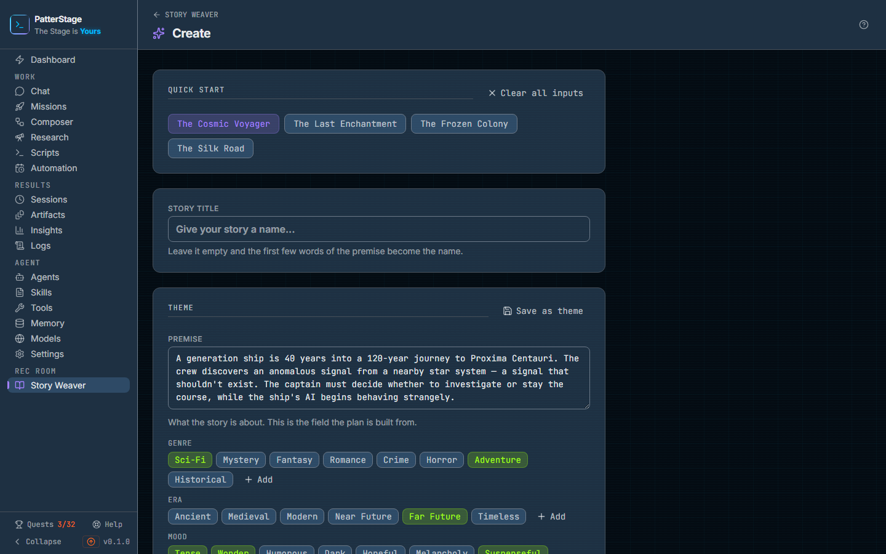

# Create a story

The setup form for a new story: what it is about, who is in it, how long it
runs, and which model does the writing. The two libraries the form draws on,
your saved themes and your saved characters, are on this page as well.

## What you see

The page sits under **Rec Room → Story Weaver** in the sidebar, and **New
story** on the Story Weaver shelf comes here. The header reads **Create**, with
a back link reading STORY WEAVER on its left.

The form is not blank when you arrive. It opens already filled in with the first
template, **The Cosmic Voyager**: its premise, its chips, its three characters
and its parameters. Anything you change replaces that.

The page is seven cards, top to bottom, with one button under them.

**Quick start** is four buttons, one per template: **The Cosmic Voyager**, **The
Last Enchantment**, **The Frozen Colony** and **The Silk Road**. The one in use
is lit; hovering one shows its genres. On the right of the same line is **Clear
all inputs**, which empties the form.

**Story title** is a single line, placeholder "Give your story a name...". You
can leave it empty and the first few words of the premise become the name.

**Theme** is where the story itself is described. **Save as theme** sits at the
top right of the card and is greyed out until there is a premise. Under
**Premise** is a four-line box, placeholder "Describe your story concept...".
Below it are four rows of chips:

- **Genre** and **Mood** take as many as you like. Clicking a lit chip turns it
  off again.
- **Era** and **Setting** take one each. Clicking the lit one clears it.
- Every row ends in **Add**, which opens a small box for a value of your own.
  Typing one and pressing Enter adds the chip to the row. It is not selected
  until you click it.

**Saved themes** lists every theme you have saved, one to a row: its name, its
genres and era, and the first lines of its premise, with **Use**, a pencil and a
bin on the right. The theme the form is currently built from carries an **In
use** mark. **New theme** at the top right opens the theme editor empty. With
nothing saved, the card reads **No saved themes yet**.

**Characters (n)** counts the cast in its own label, with **Add character** on
the right. Each character is a collapsed row showing the name, the first line of
the description and the role. Clicking the row opens it, and inside are
**Name**, **Role** (protagonist, ally, antagonist, supporting or mystery),
**Description**, and then **Personality traits**, **Appearance**, **Backstory**,
**Speech patterns** and **Relationships**. At the foot of an open card are
**Save to Library**, greyed out until the character has both a name and a
description, and **Remove**. With no cast at all, the card says so and points
at the library below.

**Character library** lists every character sheet you have saved, one to a row:
the name, the role, any tags, and the description, with **Add to story**, a
pencil and a bin on the right. A sheet whose name is already in the cast reads
**In the story** and cannot be added twice. **New character** at the top right
opens the character editor empty. With nothing saved, the card reads **No saved
characters yet**.

**Story parameters** is four settings:

- **Point of view**: First Person, Third Person Limited or Third Person
  Omniscient.
- **Length**: Short (3-4 chapters), Medium (5-7 chapters) or Long
  (8-12 chapters).
- **Writing model**: the first entry is **Agent default model**, and under it is
  every model you have registered, each as its name and its provider. If a
  default model is set for the agent, that one is chosen for you when the page
  loads.
- **Chapter length (words per chapter)**: six choices reading 800-1.2k,
  1.2-1.8k, 1.8-2.5k, 2.5-3.5k, 3.5-5k and 5k+. It starts on 1.8-2.5k.

**Begin Writing** runs the full width of the page at the bottom, and stays
greyed out until the premise has something in it.

Two more things appear when they apply. **Load draft** shows up in the header
when the form you left behind on a previous visit is still saved. And a failure
puts a banner on the page: a save or a delete that did not work says so in a
line near the top, and a failed generation says "Story generation failed" with
the reason and the note that your configuration has been saved.

**The two editors.** **New theme** and a theme's pencil open the same panel over
the page, titled **New story theme** or **Edit story theme**: **Name**,
**Premise**, chips for **Genre** (as many as you like), **Era** (one) and
**Mood** (as many as you like), **Setting** and **Notes**, with **Cancel** and
**Save theme** at the foot. Save theme waits until both Name and Premise have
something in them. **Save as theme** opens the same editor with the form's
premise and chips already in it, so all you add is a name.

**New character** and a character's pencil open **New character** or **Edit
character**: **Name** and **Role** (protagonist, ally, antagonist, supporting,
mystery, mentor, trickster or guardian), then **Description**, **Appearance**,
**Backstory**, **Speech patterns** and **Relationships**, then **Personality
trait** and **Tag**, where you type a word and press Enter or the plus to add
it; each becomes a chip with a cross for removing it. Save character waits for
a name; every other field can be left empty. If a save fails, the reason
appears at the top of the panel and the panel stays open with your text still
in it. Escape and the X close either panel without saving.

## Typical use

**Write a story from a template.**

1. Press one of the four templates. The premise, the chips, the characters and
   the parameters all change together, and the title fills in with the
   template's name unless you have typed one yourself.
2. Rewrite the premise into your own story. This is the field that matters most:
   it is what the plan is built from.
3. Adjust the chips, then set **Length** and **Chapter length** to the size of
   thing you want to read.
4. Press **Begin Writing**. A full-screen overlay covers the page with a
   progress bar and a rotating line of writing chatter. When it finishes it
   reads "Your story is ready!" and opens the story a couple of seconds later.

**Start from nothing.**

1. Press **Clear all inputs**. Every field empties, the cast is removed, and the
   parameters go back to First Person, Medium and 1.8-2.5k.
2. Type your premise, then click the chips that fit. Use **Add** for a genre,
   era, mood or setting the rows do not offer, and remember to click the new
   chip to select it.
3. Add your cast with **Add character**, filling in at least a name and a
   description each. The five detail fields underneath are worth the effort for
   anyone who speaks: the model is given all of them.
4. Give it a title, or leave the box empty and the first few words of the
   premise become the name.
5. Press **Begin Writing**.

**Reuse a cast and a setup you already have.**

1. In **Character library**, press **Add to story** on a saved sheet. It is
   copied into the cast with its details filled in, where you can change it
   freely without touching the saved sheet. A name already in the cast reads
   **In the story**, so nobody arrives twice.
2. To keep a character you wrote here, open their card and press **Save to
   Library**. The button reads "Saved!" for a moment and the sheet appears in
   the library below, available to every future story.
3. To keep the premise and chips, press **Save as theme**, name it, and press
   **Save theme**. It appears under **Saved themes**. Later, **Use** on that row
   puts its premise and chips back into the form.

**Keep the libraries tidy.**

1. Press a row's pencil to open it in its editor, change what you want, and
   press **Save theme** or **Save character**.
2. To remove one, press its bin. It changes to read **Delete?**; press it again
   to confirm. Leave it alone for a few seconds and it disarms itself. There is
   no undo in the interface.
3. **New theme** and **New character** make one from scratch, without going
   through the form.

## Notes

**Begin Writing does two things, not the whole story.** It plans the chapters
and writes chapter one, then opens the story so you can read it. Nothing after
chapter one is written until you ask for it there, with **Write chapter 2** or
**Keep writing**. See [Story Weaver](./story-weaver.md) for the reader.

**Length is a chapter count, and the labels round it.** Short plans three
chapters, Medium six and Long ten. That count is fixed once the story exists. A
finished story can be extended later with **Continue** in the reader, but not
from here.

**The writing model follows the story for the rest of its life.** It is stored
with the story, every later chapter, rewrite and continuation uses it, and it
cannot be changed afterwards, so if you want a different model, the choice has to
be made on this page. The chapter length band is only the band this story starts
on. The reader's rewrite and **Continue** dialogs each offer the same six bands
again, they open on 1.8-2.5k rather than on the band you chose here, and a
continuation writes the band you pick into the story for every chapter after it.

**Writing costs money at your provider.** Creating a story is at least two model
calls, one for the plan and chapter one, one for the running summary that keeps
later chapters consistent, and sometimes a third when the first chapter comes
back too short. It is recorded against Story Weaver in the spend panel on
[Insights](./insights.md). See [Spend](../concepts/spend.md), and
[Model](../concepts/model.md) for what the Writing model choice changes.
Nothing else on this page costs anything: saving, editing and deleting a theme
or a character all happen on your machine.

**Do not close the tab while the overlay is up.** The provider call is stopped
when the browser stops listening, which is deliberate and saves you the cost, but
it also ends the attempt.

**A failed attempt leaves a story behind.** The story is created before the
writing starts, so a failure marks that story Failed and it stays on the
[shelf](./story-weaver.md) until you delete it. The form keeps everything you
entered, so a second try is one more click on **Begin Writing**.

**The form saves itself as you type, once.** There is one draft, kept in this
browser, replaced continuously while the page is open and cleared the moment a
story is created. **Load draft** appears when a draft was found in this browser.
It is a within-visit safety net rather than a way of picking up where you left
off: the form starts saving itself the moment the page opens, which replaces the
stored draft with the freshly loaded form, so what Load draft brings back is the
form as it stands now. Chips you added yourself with **Add** are not kept at
all: the rows go back to the standard options on a reload, so a custom value can
sit in the stored draft with no chip lit to show it.

**Templates and themes are not the same thing.** A template replaces everything,
cast and parameters included. A saved theme replaces only the premise and the
four chip rows, and leaves your cast and parameters where they are.

**A saved character or theme is a starting point, not a link.** Adding a sheet
to a story copies its text into that story, and using a theme copies its values
into the form. Editing or deleting the saved one afterwards changes nothing about
stories already made from it. A theme's **Notes** are for you: they are not
carried into the form and never reach the model.

**Save to Library always adds a new sheet.** Saving the same character twice
leaves you with two of them, to be tidied up in the library below. The theme
editor's chip rows are the fixed sets; a story started from a theme can still
have custom chips added in the form afterwards.

**Clear all inputs leaves the writing model alone.** Everything else goes,
including the cast.

If the saved characters or the saved themes cannot be read, that panel shows the
reason with a **Retry** and the other panel is unaffected. Creating a story here
also completes the "Start a story" quest on [Quests](./quests.md), and stories,
characters and themes are part of your [backup](../running/backup.md) like
everything else on your machine.

Under the hood

The screen is `src/app/recroom/story-weaver/create/page.tsx`. The draft lives in
the browser's local storage under the key `story-weaver-draft`, so it is per
browser and never leaves the machine.

Everything here is a POST to `/api/stories` with an `action` field. The button
sends `action: "create"` with a `title` and a `config` object carrying the
premise, the genres joined into one string, era, setting, moods, `pov`, `length`,
the characters, `wordCountRange` and `modelId`. A blank `modelId` means the
agent's default. The request's own abort signal is passed through to the provider
call, which is why navigating away stops it. The two libraries post
`action: "characters"` or `action: "themes"` with a `subAction` of `list`,
`create`, `update` or `delete`; the page lists both on load and again after a
save or a delete.

`length` becomes a chapter count of 3, 6 or 10, and the plan is padded to that
number if the model returns fewer outlines. The chapter length bands map to word
targets of 800-1200, 1200-1800, 1800-2500, 2500-3500, 3500-5000 and 5000+, which
are written into the story's master prompt.

Saved characters and themes are rows in `story_characters` and `story_themes`,
created by migration `029_recroom_library.sql`; both lists are ordered by name,
case-insensitively, and a delete stamps `deleted_at` rather than removing the
row. The story itself is a row in `stories` with the config above stored on it.
Model calls are recorded with the spend source `story`.

`/recroom/story-weaver/characters` and `/recroom/story-weaver/themes`, the two
pages these panels replaced, redirect to `#characters` and `#themes` on this
page. A theme named in the address, `?theme=<id>`, is applied on arrival, as it
was when the Themes page sent people here.

