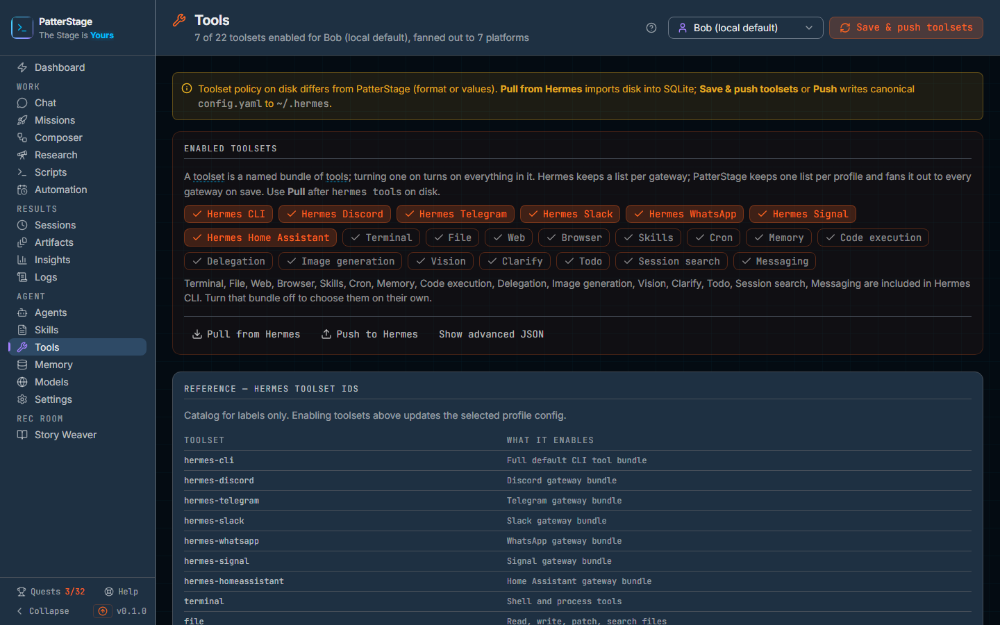

# Tools

What your agent is allowed to do, chosen one profile at a time and written straight into the agent's own configuration.

## What you see

The page opens at **Agent → Tools** in the left rail. The title bar carries a
wrench, the word **Tools**, and under it a line reading how many of the
catalogue's toolsets are enabled for the profile you have selected, and how
many gateways that list fans out to. On the right, the profile picker every
Agent screen shares, and the filled button **Save & push toolsets**, which
reads **Saving…** while it works. **Pull from Hermes** and **Push to Hermes**
sit under the grid; while one is working its label changes to **Pulling…** or
**Pushing…**, and the two hold each other until the one that is running
finishes.

Once you have used one of those buttons, a small line appears under the header
recording the outcome and the time, for example "Saved at 14:02: Toolsets saved
and pushed to Hermes". A failure shows in the same place, in red, saying
**Failed** instead.

Above the main panel sit any warnings that apply right now. There are three of
them, and you may see none:

- An amber note saying the toolset policy on disk differs from what PatterStage
  holds, with a reminder of which button imports and which button writes.
- A red note saying the last sync failed, pointing you at the gateway logs and
  asking you to retry.
- An amber note saying the gateways do not all have the same toolsets on disk.
  The grid below then shows the union of them, and saving applies one list to
  all of them.

The orange panel underneath is where the work happens. It is headed **Enabled
toolsets**, with two sentences under the heading: a toolset is a named bundle
of tools, and turning one on turns on everything in it; and PatterStage keeps
one enabled list per profile and fans it out to every gateway when you save,
so **Pull** is the button to reach for after toolsets have been changed on the
agent's own side. The words *toolset* and *tools* in that sentence are
pressable, and open a small definition beside the word. If the list did not
come from PatterStage's own store, one line says where it was read from
instead, either the agent's configuration file or the seed pack it shipped
with.

Under that is the grid itself, twenty-two buttons. Seven of them are whole
bundles, one per gateway: **Hermes CLI**, **Hermes Discord**, **Hermes
Telegram**, **Hermes Slack**, **Hermes WhatsApp**, **Hermes Signal**, **Hermes
Home Assistant**. The other fifteen are individual toolsets: **Terminal**,
**File**, **Web**, **Browser**, **Skills**, **Cron**, **Memory**, **Code
execution**, **Delegation**, **Image generation**, **Vision**, **Clarify**,
**Todo**, **Session search** and **Messaging**. One that is on is filled in and
carries a tick; one that is off is an outline. Hovering over a button tells you
what it enables.

A button can also be pressed and unclickable at the same time. That means a
bundle you have already enabled contains it, so it is on and choosing it
separately would change nothing. Under the grid a line names those toolsets and
tells you to turn the bundle off if you want to pick them individually.

Below a thin divider are **Pull from Hermes**, **Push to Hermes** and **Show
advanced JSON**, which opens a text box holding the raw per-gateway lists. Once you type into that box a warning appears saying
the JSON is what will be saved until you save or discard it, a **Discard JSON
edits** button joins the toggle, and the buttons in the grid stop responding.

The last panel on the page is the reference list of Hermes toolset IDs. A line
under its heading says it is there for the labels only, and below that is a
two-column table headed **Toolset** and **What it enables**, one row per entry
in the catalogue. It is a lookup. Nothing in it is clickable and nothing in it
changes your profile.

The **?** in the title bar opens this guide, and so does pressing the `?` key
anywhere except in a text box.

## Typical use

**Give a profile one capability.**

1. Open **Agent → Tools** and pick the profile with the picker in the header.
2. Click the toolset you want, for example **Web**. It fills in and takes a
   tick, and the header says there are changes not saved yet. The count under
   the title does not move until you save, because it counts what the agent
   has.
3. Click **Save & push toolsets**. The line under the header confirms the
   toolsets were saved and pushed, and the grid redraws from what was actually
   stored rather than from what you clicked.

**Give a profile the agent's usual working set.**

1. Click **Hermes CLI**.
2. All fifteen individual toolsets immediately show as pressed and stop
   responding, and the line under the grid names them as included in Hermes CLI.
   They are on, through the bundle.
3. Click **Save & push toolsets**. The stored list is the single bundle: the
   save drops the fifteen, because **Hermes CLI** already carries them.
4. To choose individual toolsets again, turn **Hermes CLI** off first. The
   fifteen become clickable again, but the save in the previous step stored the
   bundle alone, so they come back off and have to be chosen again. Only inside
   an unsaved session do earlier picks survive turning the bundle off.

**Take back a change that was made outside PatterStage.**

1. Click **Pull from Hermes**. It reads the agent's configuration for this
   profile back into PatterStage.
2. The grid and the count redraw from what was on disk. Anything you had
   changed and not saved is replaced.
3. To send in the other direction instead, use **Push to Hermes**, which writes
   the profile PatterStage already holds out to the agent. It redraws the grid
   from what is stored just as **Pull** does, so anything you had clicked and
   not saved is replaced. Push sends what was saved, not what is on screen.

## Notes

Saving and pushing are one act here. **Save & push toolsets** stores the list in
PatterStage and writes the agent's configuration in the same request, so there
is no separate step and no state where the two disagree because you forgot one.

If the write to the agent fails, the message says so plainly: the change is kept
in PatterStage and did not reach the agent, and the fix is to retry the push. It
is not lost, and you do not need to redo the clicking.

One list covers every gateway. PatterStage does not offer per-gateway toolsets
in the grid, because the useful question is what this agent may do rather than
what it may do over Slack in particular. If the gateways already differ on disk,
the banner says so and the grid shows the union, and the next save flattens them
to one list. The advanced JSON box is the way out if you genuinely need them to
differ.

The count in the header and the **Enabled** figure in the numbers strip count
the toolsets you have selected, which is not the same as the buttons that look
pressed: a toolset a bundle covers is on without being an entry of its own. With
**Hermes CLI** on and nothing else, sixteen buttons read as on, the bundle and
the fifteen it covers, and the count reads one. The count moves as you click,
so it matches what is stored only once you have saved.

Only **Hermes CLI** covers other toolsets on this screen. The six other gateway
bundles are enabled and disabled on their own and do not mark anything else as
covered.

The advanced JSON box takes over once you type in it. The buttons in the grid
are disabled from then until you save or press **Discard JSON edits**, so your
typing is never overwritten by a click you did not think of as an edit. What you
have typed is what gets sent, and a value that is not an object at all, a list,
a number, a bare string, is answered with **Invalid JSON object** and saves
nothing. The key names are not checked, so a mistyped gateway name is stored as
written rather than refused.

Switching profile with unsaved changes does not throw them away. The selector
holds, and a small panel offers **Discard changes** or **Keep editing**. There
is no undo after a save: the list you save replaces the one that was there.

A toolset says what is available, not what is permitted call by call. The
approval prompt in [Chat](./chat.md) is what stops one particular tool call
before it runs. A mission can suggest toolsets, but those are a hint written
into the prompt; what the agent may actually reach for comes from the profile it
runs under. See [Toolset](../concepts/toolset.md) and [Tool](../concepts/tool.md)
for the difference, and [Missions](./missions.md) for where the suggestion is
written.

Terminal access is inside the default bundle, and it is real access to the
machine PatterStage is running on. Treat a profile with **Hermes CLI** or
**Terminal** enabled as a profile that can do anything you can do at a shell.

Saving here completes the **Save a toolset** step on [Quests](./quests.md), and
counts towards the Config band on [Insights](./insights.md). The profiles
themselves are created and edited on [Agents](./agents.md), and what each
profile is allowed to *know* rather than *do* is on [Skills](./skills.md).

An install running in read-only mode refuses the save and says so, including the
setting to unset. The reference table and the grid still render, so you can read
the policy without being able to change it.

Under the hood

The agent stores `platform_toolsets` in `config.yaml`, keyed per gateway.
PatterStage stores one normalised JSON blob per profile and fans it out to all
seven platform keys on save: `cli`, `discord`, `telegram`, `slack`, `whatsapp`,
`signal`, `homeassistant`. The default profile is the agent root rather than a
row in the profiles table, which is why the sync calls for it use a different
body.

| Route | What it does |
|---|---|
| `GET /api/agent/profiles/[id]/toolsets` | Returns the per-gateway lists, the union used by the grid, whether the gateways diverge, and where the value was read from. |
| `PUT /api/agent/profiles/[id]/toolsets` | Normalises the submitted lists, stores them, and pushes the profile to the agent. |
| `POST /api/agent/profiles/sync/pull` | Reads the profile back from disk. |
| `POST /api/agent/profiles/sync/push` | Writes the stored profile to disk. |

The read reports a `source` of `database`, `config_yaml` or `seed_pack`. The
last two mean the value was hydrated from outside and normalised on the way in,
which is what the "read from" line above the grid is reporting. A value that
already came from the database is not re-normalised on read, because doing so
rewrote the row on every GET and lost individually enabled toolsets.

Coverage and the normaliser are the same constant read two ways.
`HERMES_CLI_SUBSUMED` in `src/modules/hermes/lib/toolset-normalize.ts` lists the
fifteen ids the `hermes-cli` bundle expands to; the write path drops them when
that bundle is present, and `bundleCovering` in `toolset-coverage.ts` reads the
same set to decide which buttons are pressed and unclickable. Deriving both from
one list is deliberate: two lists that can drift apart is exactly how a button
ends up turning itself off after a successful save.

A successful save records a `toolset.saved` analytics event against the profile.
Writes are refused when `PS_READ_ONLY` is set to `1` or `true`; the read route
still answers under that flag, skipping only the persistence half of hydration.

