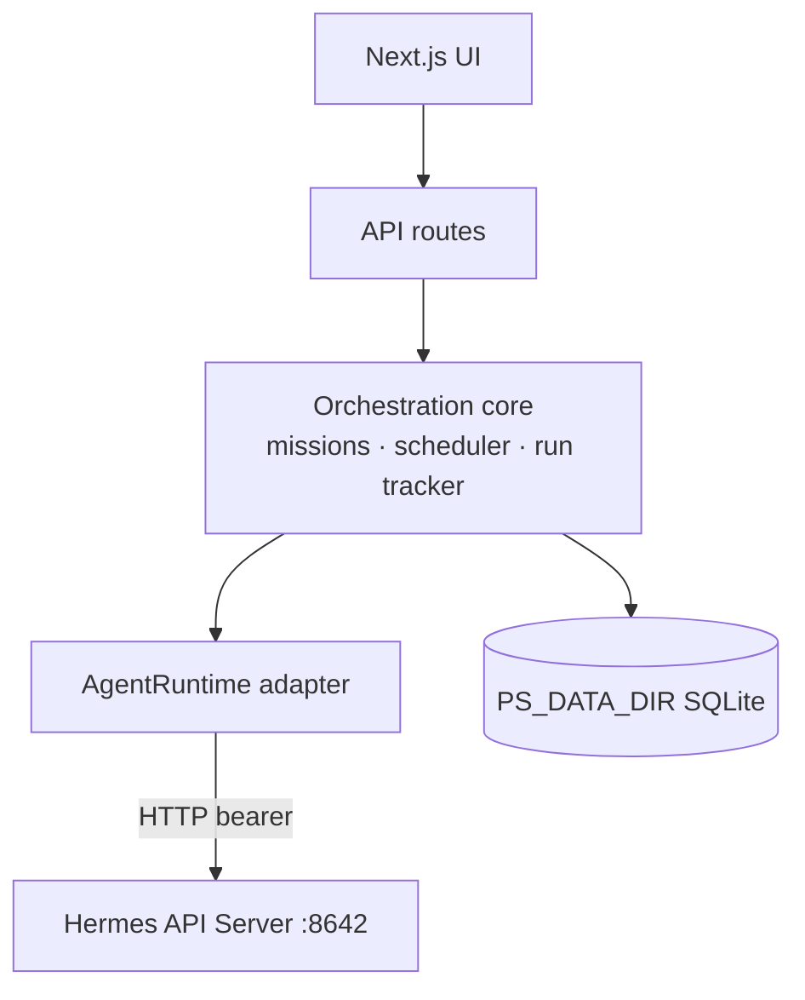

# Runtime architecture

How PatterStage executes and schedules agent work after the runtime rewrite. The short version: **Hermes is a remote HTTP service**, PatterStage owns orchestration and scheduling, and a single adapter is the only seam to the backend.

## Layers

```
API routes  (RESTful, Zod, ApiResponse<T>)
    │
Orchestration core  src/lib/orchestration/
    │   dispatch.ts        mission → runtime.submitRun() → runs + session rows
    │   run-reconcile.ts   poll runtime.getRun() for non-terminal runs (RunSync)
    │   scheduler/         BackgroundScheduler · tick.ts · (next-run math)
    │
Runtime adapter  src/lib/runtime/
    │   AgentRuntime (types.ts)  the one seam: submit/poll/stream/stop/approve + discovery
    │   HermesRuntime            typed client over the Hermes API Server
    │
Hermes API Server  :8642  (API_SERVER_ENABLED=true, bearer auth)
```

## The runtime adapter (`src/lib/runtime/`)

`AgentRuntime` is framework-agnostic: nothing Hermes-specific leaks through it. `HermesRuntime` maps it to the API Server:

| AgentRuntime method | Hermes endpoint |
|---|---|
| `submitRun` | `POST /v1/runs` (Idempotency-Key = our run id) |
| `getRun` | `GET /v1/runs/{id}` |
| `streamRunEvents` | `GET /v1/runs/{id}/events` (SSE) |
| `stopRun` | `POST /v1/runs/{id}/stop` |
| `health` / `capabilities` | `GET /health/detailed` · `/v1/capabilities` |
| `listModels/Skills/Toolsets` | `GET /v1/models` · `/v1/skills` · `/v1/toolsets` |
| `createSession` | `POST /api/sessions` |

Auth: `Authorization: Bearer ${API_SERVER_KEY}` (resolved in `runtime/secrets.ts`). Endpoints are resolved per profile in `runtime/endpoint-registry.ts` (each Hermes profile is its own gateway process/port; Phase-1 default resolves all to the configured gateway). Swap in another backend by implementing `AgentRuntime` and changing the `runtime` binding in `runtime/index.ts`. Nothing above the seam changes.

### The DB is the source of truth

PatterStage's SQLite DB is authoritative for models, profiles, memory config, and the active framework; the Hermes config/profile files are a **downstream projection** written from the DB. `importHermesStateFromDisk` is the one path that reads Hermes → DB, and it is **idempotent + explicit**: guarded by `isHermesStateAlreadyImported`, run only on first setup or an explicit `--pull`, and never at boot, so the DB is never silently overwritten. A parallel **`FrameworkAdapter`** seam ([`src/lib/frameworks/`](../../src/lib/frameworks)) records the active agent framework + its home in the DB-owned `frameworks` registry (Hermes is impl #1); add a `case` + adapter to support a second framework. (Memory has the analogous [`MemoryProvider`](../guides/memory.md) seam.)

## Mission runs (no bash)

A dispatch is one HTTP **run**:

1. `dispatchMissionRun(missionId)` inserts a `runs` row (id = Idempotency-Key), pre-registers a session, and calls `runtime.submitRun()`.
2. `RunSync` (on the background tick) polls `runtime.getRun()` for `started` runs and writes terminal state to the run + mission + session rows. A 404 from the backend means the run is gone → failed.
3. Cancellation is `runtime.stopRun()`: no pid files, signals, or `pkill`.

The whole app routes through this: the missions god-route and the queue both call `dispatchMissionNow`, which delegates to `dispatchMissionRun`.

## PatterStage-owned scheduler

The timer lives in PatterStage, not the agent.

- A `schedules` row holds the canonical schedule, `next_run_at`, `catch_up_policy`, and repeat count.
- `BackgroundScheduler` is started by `src/instrumentation.ts` at server boot, so it ticks **independent of HTTP traffic** (an idle host still fires schedules). It reuses the outage-hardened `SyncScheduler` loop and a `meta`-table ownership lease.
- The tick (`scheduler/tick.ts`) selects due rows, claims each occurrence with a deterministic run id (PK guard → exactly-once under double-tick), dispatches via the runtime, and advances `next_run_at` using the dependency-free cron/interval math in `src/lib/schedule/next-run.ts`.
- Restart-safe: due work is recomputed from `next_run_at`, never an in-memory timer.

Manage via `/api/schedules` or the Schedules section on **Work → Missions**.

## Data model

- `runs`: one agent execution (id, backend run_id, mission_id, schedule_id, status, output, usage, timestamps).
- `schedules`: CH-owned recurring definitions (next_run_at drives firing).
- `agent_profiles.{gateway_host,gateway_port,api_key_ref}`: per-profile gateway endpoints.

## Testing the whole stack

A zero-dependency **mock Hermes API Server** (`mock-hermes/server.mjs`) implements the contract (runs/sessions/chat/discovery/health) so the platform runs end-to-end with no real agent or API keys.

```bash
docker compose up --build           # PatterStage + mock Hermes
PS_URL=http://localhost:42069 node tests/integration/runtime/full-stack-smoke.mjs
# or locally:
npm run mock-hermes &               # :8642
HERMES_GATEWAY_URL=http://127.0.0.1:8642 API_SERVER_KEY=dev npm start
npm run test:e2e-runtime
```

### Real-Hermes integration gate (validated)

`docker-compose.real-hermes.yml` runs PatterStage against the **actual Hermes Agent** (official `nousresearch/hermes-agent` image, API server enabled) pointed at a deterministic **mock LLM** (`mock-llm/`): real Hermes machinery, no API keys/cost. Swap the mock for a real local model via `HERMES_LLM_BASE_URL`.

```bash
npm run test:e2e-hermes      # build stack, run contract + smoke against REAL Hermes, tear down
```

`tests/integration/runtime/hermes-contract.mjs` asserts the exact API shapes `HermesRuntime` depends on. **Confirmed against Hermes 0.16**, including the four shapes the docs got wrong (now handled + tested):

| Contract point | Real shape |
|---|---|
| `POST /v1/runs` | `{run_id, status:"started"}` |
| `GET /v1/runs/{id}` | `{status: started→running→completed, output, usage:{input_tokens,output_tokens,total_tokens}, session_id}` |
| SSE `/v1/runs/{id}/events` | `data:`-only lines; event name in **`data.event`** (`message.delta`, `reasoning.available`, `run.completed`) |
| `GET /v1/skills` · `/v1/toolsets` | `{object:"list", data:[…]}` (**nested**, not a bare array) |
| `POST /api/sessions` | `{object:"hermes.session", session:{id,…}}` (**nested**) |
| `POST /v1/runs/{id}/stop` | `{status:"stopping"}` · auth: `Bearer`, 401 without |

For a **production real Hermes**: enable the API server (`setup.sh` writes `API_SERVER_ENABLED=true` + a shared `API_SERVER_KEY` into `~/.hermes/.env`), run `hermes gateway`, and point `HERMES_GATEWAY_URL` at it.

## Composer rides the same substrate

[Composer](../guides/composer.md) (the graph orchestrator) reuses this layer rather than adding a second one. Each Composer **stage** is an ordinary agent run (linked via `runs.composer_node_run_id`); a `ComposerTickSource` joins `RunSync` + `ScheduleTickSource` on the `BackgroundScheduler` (gated by the ownership lease + the `composer` flag); and `reconcileOne` is **polymorphic**: it branches on `composer_node_run_id` to finalize a stage (parse its verdict, merge context) and advance the graph, otherwise it finalizes a mission. This is why we did **not** adopt LangGraph: it would bolt a second durable/checkpoint model onto the restart-safe, single-flight, idempotent substrate we already hardened. We added only the graph control-flow layer.

## Live updates: polling + SSE

Durable state is always the DB; **polling is authoritative** (it drives reconcile and survives reconnect/restart/multi-tab). **SSE is the live-richness layer** (`src/lib/sse/event-stream.ts` + `useEventStream`): because PatterStage can run multiple processes, the stream bridges via the shared DB: it polls a snapshot of the authoritative rows and pushes deltas, closing on a terminal snapshot or disconnect. If SSE drops, `useApiResource` polling keeps the view correct. Used by Composer (`…/runs/[id]/events`) and Deep Research (`…/research/[id]/events`).

## What was removed

The bash mission backend (`backends/hermes.ts`), the `agent-backend/` interface, status.json/pid polling (`MissionSync`), the stdout session-id parsing, and the legacy Hermes `jobs.json` cron bridge (+ the **Cron** page) are all gone. Recurring work uses **Missions** scheduling (the PatterStage `schedules` scheduler).

---

## Where the platform is going

Merged from `PLATFORM_VISION.md` in T-0109, so one page answers one question.

## PatterStage platform vision

PatterStage is the **Next.js control plane and orchestrator** I ship for [Hermes Agent](https://github.com/NousResearch/hermes-agent). It owns missions, scheduling, configuration, sessions, memory, and day-to-day operator workflows. Agent **execution** is handed off to a backend over its HTTP API (Hermes today, any framework tomorrow) through a single runtime adapter. PatterStage state lives in its own SQLite database; the agent is a remote service it talks to, not a process it shell-spawns.

## Architecture (layers)



- **Orchestration core** (`src/lib/orchestration/`) owns the mission lifecycle, the **PatterStage-owned scheduler**, and run reconciliation. It is framework-agnostic.
- **Runtime adapter** (`src/lib/runtime/`) is the one seam to a backend. `AgentRuntime` is modelled on async run semantics (submit / poll / stream / stop / approve + discovery); `HermesRuntime` implements it over the Hermes **API Server** (`API_SERVER_ENABLED=true`, default `http://127.0.0.1:8642`, bearer auth). Swapping in another framework means implementing `AgentRuntime`. Nothing above the seam changes.
- **PatterStage state** lives under **`PS_DATA_DIR`** (SQLite: missions, **runs**, **schedules**, models, credentials, profiles, sessions, templates, stories). The **Hermes install** (`HERMES_HOME`) is touched only for config Hermes reads from files (`config.yaml` / `.env` / profile files), behind one write-back module with drift detection.

## Scheduling: PatterStage owns the timer

The "when does this run" decision lives in PatterStage, **not** in the agent.

- A `schedules` row is the source of truth (`next_run_at`, cron/interval/one-shot, `catch_up_policy`, repeat). The **scheduler tick** (`src/lib/orchestration/scheduler/`) selects due rows and dispatches a run via the runtime, then advances `next_run_at`.
- The scheduler is **traffic-independent**: `src/instrumentation.ts` boots it at server start, so it fires on an idle host with zero inbound HTTP.
- It is **restart-safe** (due work is recomputed from `next_run_at`, never an in-memory timer) and **exactly-once** (each occurrence is claimed under a deterministic run-id PK guard; `Idempotency-Key` protects the backend submit).
- `parseSchedule` + a dependency-free cron evaluator (`src/lib/schedule/next-run.ts`) compute fire times. There is no Hermes `jobs.json` and no Python cron bridge.

## Runs (not bash)

A mission dispatch is a single HTTP **run**: `runtime.submitRun()` returns a `run_id`; a `runs` row tracks it; `RunSync` reconciles it by polling `runtime.getRun()` on the background tick. Cancellation is `runtime.stopRun()`. There are no bash wrappers, pid files, `status.json` polling, or process-group signals.

## Core features

| Area | Role |
|------|------|
| Missions | CRUD + dispatch as HTTP runs; live run state via `runs`. |
| Scheduling | PatterStage-owned `schedules` + scheduler tick → runtime. `/api/schedules`. |
| Model / provider | SQLite registry + `/api/models`, `/api/credentials`; write-through to Hermes `config.yaml` / `.env`. |
| Config / sessions / memory / gateway / logs / skills / personalities | Hermes-aligned surfaces; sessions/skills/toolsets discovered via the runtime. |
| Stats & analytics | `/api/stats` aggregate powers the command-center dashboard (throughput, mission mix, run-activity heatmap, vitals, token usage) + per-entity insight strips + per-agent performance. Light derived progression (level / streak / achievements) presents engagement as stats, never gates functionality. |

## Testing the whole stack anywhere

`docker compose up --build` runs PatterStage against a **mock Hermes API Server** (`mock-hermes/`), with no real agent or API keys needed. The fast smoke (`npm run test:e2e-runtime`) drives mission → run → reconcile, schedules, and cancel through the real HTTP surface. For higher fidelity, **`npm run test:e2e-hermes`** brings up the **real** Hermes Agent (official image, pinned digest) + a mock LLM and validates 18 contract points, a full-stack smoke, and a DB upgrade-path step. This local run is the **merge gate** for runtime/DB changes. For a real agent in dev, point `HERMES_GATEWAY_URL` at a running `hermes gateway` (API server enabled).

## Security

- **Every request is authenticated.** `src/proxy.ts` requires a bearer token or the
  `ps_session` cookie on every path except a small public set on safe methods, and
  fails closed when no token has been minted. Do not design as though the UI and API
  were same-trust: they are not, and new code must not assume a caller is already
  trusted because it reached the port.
- The runtime authenticates to the Hermes API Server with a bearer key (`API_SERVER_KEY`); keep that gateway bound to localhost, because it grants the agent's full toolset including terminal access.

## Related docs

- [RUNTIME_ARCHITECTURE.md](runtime-architecture.md): how a dispatch becomes a run, end to end.
- [MISSIONS.md](../guides/missions.md): mission board, dispatch, cancellation.
- [HERMES_CONFIG_INTEGRATION.md](../running/env-reference.md): Hermes path/config integration.
- [DEPLOY.md](../running/deploy.md): host, port, TLS, Docker.
