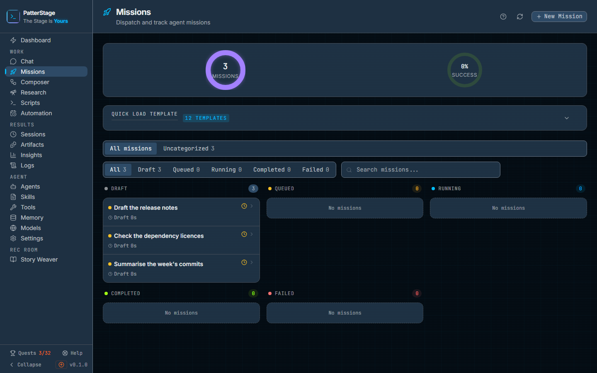
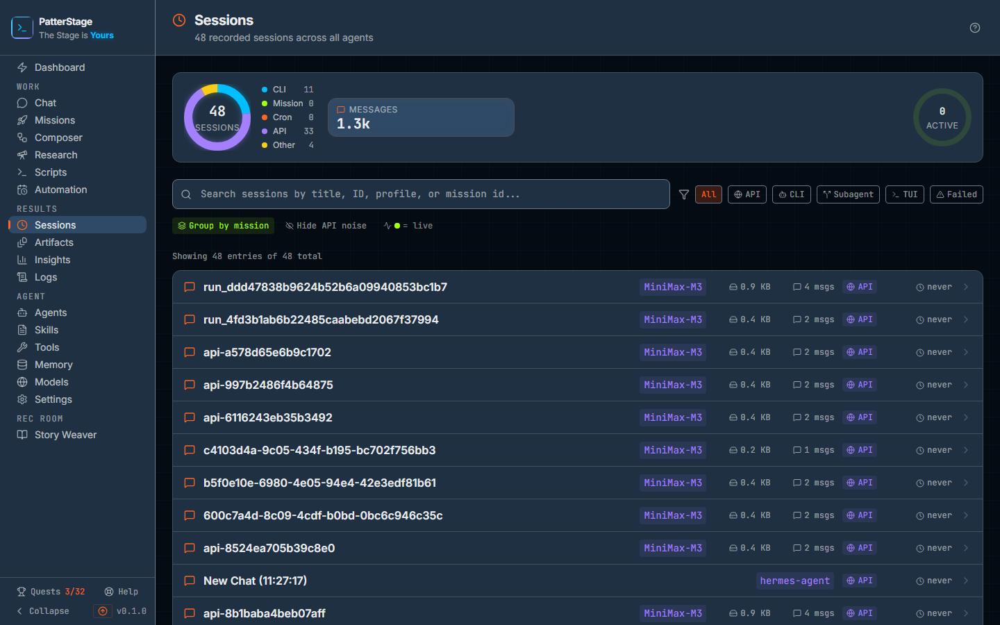
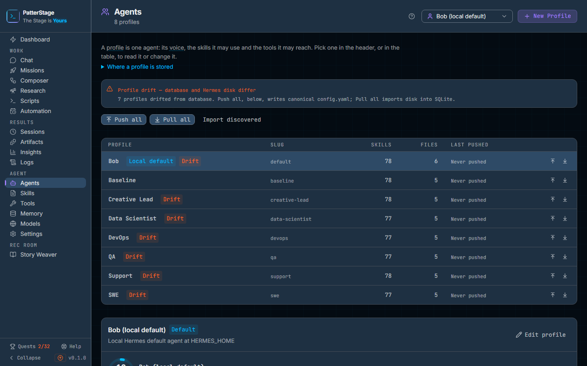
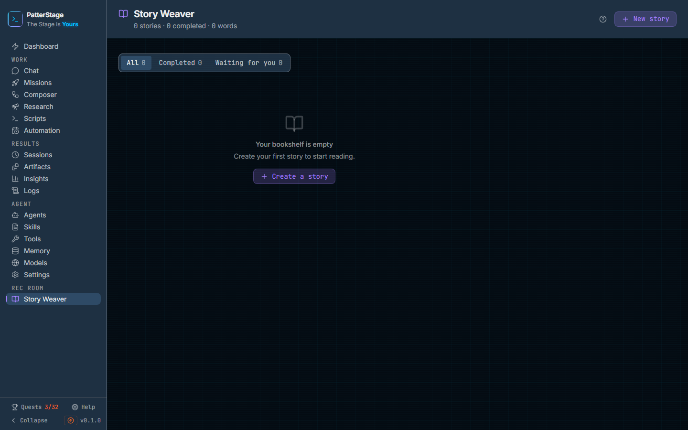

# The tour

Every screen PatterStage has, in the order the sidebar lists them, so you can see
the whole product in a few minutes before deciding where to start.

This page is a map, not a manual. Each stop shows you what the screen looks like
and says in one line what it is for; the link takes you to that screen's own
guide, which is where the detail lives. Nothing here is written twice.

If you would rather learn by doing than by reading, [the quests](quests.md) walk
you through the same ground one real action at a time, and
[the first hour](first-hour.md) is the shortest path from a fresh install to a
piece of work you dispatched and read the output of.

## Where you land

**[Dashboard](../guides/dashboard.md)**: how the install is doing right now, and
what to do next.

## Work

Where you give the agent something to do.

- **[Chat](../guides/chat.md)**: a conversation, a turn at a time, with the
  agent's reasoning and tool calls visible as it works.
- **[Missions](../guides/missions.md)**: one instruction, dispatched once or on a
  schedule. The main way work gets done.
- **[Composer](../guides/composer.md)**: several steps chained together, where
  chosen stages stop and wait for your decision.
- **[Research](../guides/research.md)**: a question answered by many searches,
  which writes a report you keep.
- **[Scripts](../guides/scripts.md)**: your own shell or Node scripts on a timer,
  with no agent involved.

## Results

Where the record of that work lives.

- **[Sessions](../guides/sessions.md)**: every conversation the agent has had,
  filtered and searchable, with the full transcript.
- **[Artifacts](../guides/artifacts.md)**: the things it produced, to read and
  download.
- **[Insights](../guides/insights.md)**: the history: how much ran, how it went,
  what it cost.
- **[Logs](../guides/logs.md)**: the server's own log files.

## Agent

Where you shape the agent itself.

- **[Agents](../guides/agents.md)**: profiles, their personalities, and keeping
  them in step with Hermes.
- **[Skills](../guides/skills.md)**: the catalogue of things it knows how to do.
- **[Tools](../guides/tools.md)**: the toolsets it is allowed to reach for.
- **[Memory](../guides/memory.md)**: what it remembers between conversations.
- **[Models](../guides/models.md)**: which model answers, and the keys that pay
  for it.
- **[Settings](../guides/settings.md)**: everything else about this install,
  including backups and updates.

## Rec Room

The part of the product that is for enjoying rather than operating.

- **[Story Weaver](../guides/story-weaver.md)**: write long fiction with the
  agent, a chapter at a time, from a shelf of what you have written, with
  saved characters and themes on [Create a story](../guides/story-create.md)
  to reuse.

## Always to hand

- **[Quests](../guides/quests.md)**: thirty-two real things to do, ticked off by
  the product as you do them.
- **[Help](../guides/help.md)**: these same pages, inside the app. Every screen's
  header carries a **?** that opens its own guide.

## Where to go next

Read [the first hour](first-hour.md) if you have just installed it, or open the
guide for whichever screen above looked most like what you came here to do.
